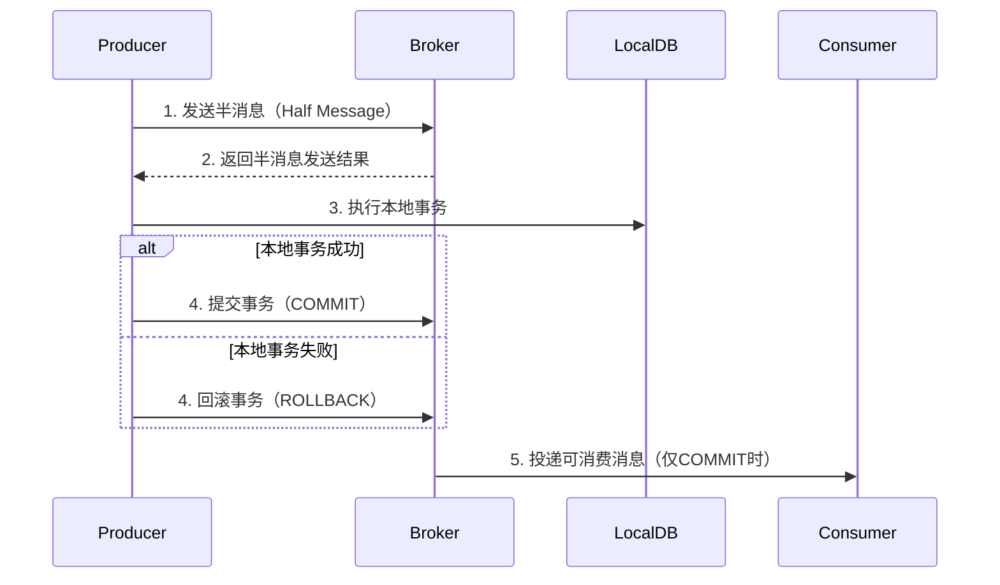

本文提供 RocketMQ 4.X 在 Java 环境下的消息发送示例。通过代码演示 Producer 的创建、消息构建及发送流程，帮助开发者快速集成 RocketMQ 实现高效消息通信。

<!-- more -->

***

## 准备 Maven 项目

- 导入 MQ 客户端依赖

  ```xml
  <dependency>
      <groupId>org.apache.rocketmq</groupId>
      <artifactId>rocketmq-client</artifactId>
      <version>4.4.0</version>
  </dependency>
  ```

## 消息的生产和消费步骤

### 消息生产者（Producer）步骤

1. 初始化生产者实例

   ```java
   DefaultMQProducer producer = new DefaultMQProducer("ProducerGroupName");
   ```

2. 配置 Nameserver 地址

   ```java
   producer.setNamesrvAddr("nameserver1:9876;nameserver2:9876");
   ```

3. 启动生产者

   ```java
   producer.start();
   ```

4. 创建消息对象

   ```java
   Message msg = new Message(
       "TopicTest",         // 主题
       "TagA",             // 标签（可选）
       "Hello RocketMQ".getBytes()  // 消息体
   );
   ```

5. 发送消息
   • 同步发送（阻塞等待响应）

   ```java
   SendResult result = producer.send(msg);
   ```

   • 异步发送（回调处理）

   ```java
   producer.send(msg, new SendCallback() { ... });
   ```

6. 关闭生产者

   ```java
   producer.shutdown();
   ```

### 消息消费者（Consumer）步骤

1. 初始化消费者实例

   ```java
   DefaultMQPushConsumer consumer = new DefaultMQPushConsumer("ConsumerGroupName");
   ```

2. 配置 Nameserver 地址

   ```java
   consumer.setNamesrvAddr("nameserver1:9876;nameserver2:9876");
   ```

3. 订阅主题和标签

   ```java
   consumer.subscribe("TopicTest", "TagA || TagB"); // * 表示订阅所有标签
   ```

4. 注册消息监听器

   ```java
   consumer.registerMessageListener(new MessageListenerConcurrently() {
       @Override
       public ConsumeConcurrentlyStatus consumeMessage(
           List<MessageExt> msgs,
           ConsumeConcurrentlyContext context
       ) {
           // 处理消息逻辑
           return ConsumeConcurrentlyStatus.CONSUME_SUCCESS; // 或 RECONSUME_LATER
       }
   });
   ```

5. 启动消费者

   ```java
   consumer.start();
   ```

6. （可选）关闭消费者

   ```java
   consumer.shutdown();
   ```

### 关键注意事项

1. Nameserver 地址：需与 Broker 配置一致，多个地址用分号分隔。

2. 消费者组名：同一消费组内的消费者共享消息（集群模式）。

3. Tag 过滤：支持 SQL 表达式（如 `TagA OR TagB`），`*` 匹配所有 Tag。

4. 消息监听器：
   • `MessageListenerConcurrently`：并发消费（默认）。

   • `MessageListenerOrderly`：顺序消费（需 Broker 配置支持）。

5. 资源释放：生产环境需在应用退出时调用`shutdown()`。

## 消息发送 API

| 发送方式 | 方法签名示例                                                                                           | 特点                                        | 适用场景                     | 注意事项                                                      |
| ---- | ------------------------------------------------------------------------------------------------ | ----------------------------------------- | ------------------------ | --------------------------------------------------------- |
| 同步发送 | `SendResult send(Message msg)`                                                                   | - 阻塞等待 Broker 返回结果 - 高可靠性 - 性能较低（依赖网络 RT） | 重要通知、订单创建等需确认结果的场景       | 需处理`RemotingException`/`MQClientException`等异常             |
| 异步发送 | `void send(Message msg, SendCallback callback)`                                                  | - 非阻塞，通过回调返回结果 - 高性能 - 需处理回调逻辑            | 高吞吐场景（如日志上报）             | 回调中需检查`SendStatus`，失败时可能需重试                               |
| 单向发送 | `void sendOneway(Message msg)`                                                                   | - 不等待 Broker 响应 - 最高性能 - 可靠性最低            | 日志采集、监控数据等可容忍丢失的场景       | 消息可能丢失，不可用于关键业务                                           |
| 顺序发送 | `SendResult send(Message msg, MessageQueueSelector selector, Object arg)`                        | - 保证同一业务 ID 的消息按顺序写入同一队列 - 需自定义队列选择器      | 订单状态变更、时序数据（如 Binlog 同步） | 必须确保同一业务 Key 选择同一队列，否则顺序失效                                |
| 延迟消息 | `msg.setDelayTimeLevel(3)`                                                                       | - 消息延迟投递（Broker 预设级别） - 不支持任意时间精度         | 定时任务、订单超时关闭              | RocketMQ 4.x 仅支持固定延迟级别（1s/5s/10s/30s/1m...），5.x 支持自定义延迟时间 |
| 事务消息 | `TransactionSendResult sendMessageInTransaction(Message msg, LocalTransactionExecuter executer)` | - 两阶段提交（半消息+本地事务） - 最终一致性                 | 分布式事务（如支付+库存扣减）          | 需实现`LocalTransactionExecuter`接口处理本地事务和回查逻辑                |
| 批量发送 | `SendResult send(Collection<Message> msgs)`                                                      | - 单次发送多条消息 - 减少网络开销                       | 批量数据导入（如 CSV 文件处理）       | 单批次消息总大小不超过 4MB（默认限制）                                     |

**性能与可靠性对比**

| 维度   | 同步发送  | 异步发送 | 单向发送  |
| ---- | ----- | ---- | ----- |
| 可靠性  | ⭐⭐⭐⭐⭐ | ⭐⭐⭐⭐ | ⭐⭐    |
| 吞吐量  | ⭐⭐    | ⭐⭐⭐⭐ | ⭐⭐⭐⭐⭐ |
| 实时反馈 | 是     | 回调通知 | 无     |

## 消息发送

### 发送同步消息

- 这种可靠性同步地发送方式使用的比较广泛，比如：重要的消息通知，短信通知。

- `SendResult send(Message msg) `

  ```java
  public class SyncProducer {
  	public static void main(String[] args) throws Exception {
      	// 实例化消息生产者Producer
          DefaultMQProducer producer = new DefaultMQProducer("please_rename_unique_group_name");
      	// 设置NameServer的地址
      	producer.setNamesrvAddr("localhost:9876");
      	// 启动Producer实例
          producer.start();
      	for (int i = 0; i < 100; i++) {
      	    // 创建消息，并指定Topic，Tag和消息体
      	    Message msg = new Message(
                  "TopicTest",
          		"TagA",
                  /* Message body */
                  ("Hello RocketMQ " + i).getBytes(RemotingHelper.DEFAULT_CHARSET)
          	);
          	// 发送消息到一个Broker
              SendResult sendResult = producer.send(msg);
              // 通过sendResult返回消息是否成功送达
              System.out.printf("%s%n", sendResult);
      	}
      	// 如果不再发送消息，关闭Producer实例。
      	producer.shutdown();
      }
  }
  ```

### 发送异步消息

- 异步消息通常用在对响应时间敏感的业务场景，即发送端不能容忍长时间地等待 Broker 的响应。

- `send(Message msg, SendCallback sendCallback) `

  ```java
  public class AsyncProducer {
  	public static void main(String[] args) throws Exception {
      	// 实例化消息生产者Producer
          DefaultMQProducer producer = new DefaultMQProducer("please_rename_unique_group_name");
      	// 设置NameServer的地址
          producer.setNamesrvAddr("localhost:9876");
      	// 启动Producer实例
          producer.start();
          producer.setRetryTimesWhenSendAsyncFailed(0);
      	for (int i = 0; i < 100; i++) {
                  final int index = i;
              	// 创建消息，并指定Topic，Tag和消息体
                  Message msg = new Message("TopicTest",
                      "TagA",
                      "OrderID188",
                      "Hello world".getBytes(RemotingHelper.DEFAULT_CHARSET));
                  // SendCallback接收异步返回结果的回调
                  producer.send(msg, new SendCallback() {
                      @Override
                      public void onSuccess(SendResult sendResult) {
                          System.out.printf("%-10d OK %s %n", index,
                              sendResult.getMsgId());
                      }
                      @Override
                      public void onException(Throwable e) {
        	              System.out.printf("%-10d Exception %s %n", index, e);
        	              e.printStackTrace();
                      }
              	});
      	}
      	// 如果不再发送消息，关闭Producer实例。
      	producer.shutdown();
      }
  }
  ```

### 单向发送消息

- 这种方式主要用在不特别关心发送结果的场景，例如日志发送。

- `sendOneway(Message msg)`

  ```java
  public class OnewayProducer {
  	public static void main(String[] args) throws Exception{
      	// 实例化消息生产者Producer
          DefaultMQProducer producer = new DefaultMQProducer("please_rename_unique_group_name");
      	// 设置NameServer的地址
          producer.setNamesrvAddr("localhost:9876");
      	// 启动Producer实例
          producer.start();
      	for (int i = 0; i < 100; i++) {
          	// 创建消息，并指定Topic，Tag和消息体
          	Message msg = new Message("TopicTest",
                  "TagA",
                  /* Message body */
                  ("Hello RocketMQ " + i).getBytes(RemotingHelper.DEFAULT_CHARSET)
          	);
          	// 发送单向消息，没有任何返回结果
          	producer.sendOneway(msg);

      	}
      	// 如果不再发送消息，关闭Producer实例。
      	producer.shutdown();
      }
  }
  ```

## 消费消息

- 广播消费

  - **一条消息被多个 Consumer 消费**

  - Consumer 属于同一个 Consumer Group

  - 消息也会被 Consumer Group 中的每个 Consumer 都消费一次

  - 广播消费中的 Consumer Group 概念可以讣为在消息划分方面无意义

  - 在 CORBA Notification 规范中，消费方式都属于广播消费。

  - 在 JMS 规范中，相当亍 JMS publish/subscribe model

- 集群消费

  - 一个 Consumer Group 中的 Consumer 实例**平均分摊消费消息**

  - 例如某个 Topic 有 9 条消息，其中一个 Consumer Group 有 3 个实例（可能是 3 个进程，或者 3 台机器），那举每个实例只消费其中的 3 条消息。

  - 在 CORBA Notification 规范中，无此消费方式。

  - 在 JMS 规范中，JMS point-to-point model 与之类似

  - 但是 RocketMQ 的集群消费功能大等于 PTP 模型。 因为 RocketMQ 单个 Consumer Group 内的消费者类似于 PTP，但是一个 Topic/Queue 可以被多个 Consumer Group 消费。

### 负载均衡模式

- 消费者采用负载均衡方式消费消息，**多个消费者共同消费队列消息**，每个消费者处理的消息不同

- `consumer.setMessageModel(MessageModel.CLUSTERING);`

  - `BROADCASTING("BROADCASTING")`: 广播消费
  - `CLUSTERING("CLUSTERING")` 集群消费

  ```java
  public static void main(String[] args) throws Exception {
      // 实例化消息生产者,指定组名
      DefaultMQPushConsumer consumer = new DefaultMQPushConsumer("group1");
      // 指定Namesrv地址信息.
      consumer.setNamesrvAddr("localhost:9876");
      // 订阅Topic
      consumer.subscribe("Test", "*");
      //负载均衡模式消费
      consumer.setMessageModel(MessageModel.CLUSTERING);
      // 注册回调函数，处理消息
      consumer.registerMessageListener(new MessageListenerConcurrently() {
          @Override
          public ConsumeConcurrentlyStatus consumeMessage(List<MessageExt> msgs,
                                                          ConsumeConcurrentlyContext context) {
              System.out.printf("%s Receive New Messages: %s %n",
                                Thread.currentThread().getName(), msgs);
              return ConsumeConcurrentlyStatus.CONSUME_SUCCESS;
          }
      });
      //启动消息者
      consumer.start();
      System.out.printf("Consumer Started.%n");
  }
  ```

### 广播模式

- 消费者采用广播的方式消费消息，一条消息被多个消费者使用，每个消费者消费的消息都是相同的。

  ```java
  public static void main(String[] args) throws Exception {
      // 实例化消息生产者,指定组名
      DefaultMQPushConsumer consumer = new DefaultMQPushConsumer("group1");
      // 指定Namesrv地址信息.
      consumer.setNamesrvAddr("localhost:9876");
      // 订阅Topic
      consumer.subscribe("Test", "*");
      //广播模式消费
      consumer.setMessageModel(MessageModel.BROADCASTING);
      // 注册回调函数，处理消息
      consumer.registerMessageListener(new MessageListenerConcurrently() {
          @Override
          public ConsumeConcurrentlyStatus consumeMessage(List<MessageExt> msgs,
                                                          ConsumeConcurrentlyContext context) {
              System.out.printf("%s Receive New Messages: %s %n",
                                Thread.currentThread().getName(), msgs);
              return ConsumeConcurrentlyStatus.CONSUME_SUCCESS;
          }
      });
      //启动消息者
      consumer.start();
      System.out.printf("Consumer Started.%n");
  }
  ```

## 顺序消息

- 消息有序指的是可以按照消息的发送顺序来消费(FIFO)。

- RocketMQ 可以严格的保证消息有序，可以分为分区有序或者全局有序。

- 顺序消费的原理解析，在默认的情况下消息发送会采取 Round Robin 轮询方式把消息发送到不同的 queue(分区队列)；而消费消息的时候从多个 queue 上拉取消息，这种情况发送和消费是不能保证顺序。但是如果**控制发送的顺序消息只依次发送到同一个 queue 中，消费的时候只从这个 queue 上依次拉取，则就保证了顺序。**

  - 当发送和消费参与的 queue 只有一个，则是全局有序；
  - 如果多个 queue 参与，则为分区有序，即相对每个 queue，消息都是有序的。

- 下面用订单进行分区有序的示例。一个订单的顺序流程是：创建、付款、推送、完成。订单号相同的消息会被先后发送到同一个队列中，消费时，同一个 OrderId 获取到的肯定是同一个队列。

### 顺序消息生产

- `send(Message msg, MessageQueueSelector selector, Object arg) `

  ```java
  /**
  * Producer，发送顺序消息
  */
  public class Producer {

     public static void main(String[] args) throws Exception {
         DefaultMQProducer producer = new DefaultMQProducer("please_rename_unique_group_name");

         producer.setNamesrvAddr("127.0.0.1:9876");

         producer.start();

         String[] tags = new String[]{"TagA", "TagC", "TagD"};

         // 订单列表
         List<OrderStep> orderList = new Producer().buildOrders();

         Date date = new Date();
         SimpleDateFormat sdf = new SimpleDateFormat("yyyy-MM-dd HH:mm:ss");
         String dateStr = sdf.format(date);
         for (int i = 0; i < 10; i++) {
             // 加个时间前缀
             String body = dateStr + " Hello RocketMQ " + orderList.get(i);
             Message msg = new Message("TopicTest", tags[i % tags.length], "KEY" + i, body.getBytes());

             SendResult sendResult = producer.send(msg, new MessageQueueSelector() {
                 @Override
                 public MessageQueue select(List<MessageQueue> mqs, Message msg, Object arg) {
                     Long id = (Long) arg;  //根据订单id选择发送queue
                     long index = id % mqs.size();
                     return mqs.get((int) index);
                 }
             }, orderList.get(i).getOrderId());//订单id

             System.out.println(String.format("SendResult status:%s, queueId:%d, body:%s",
                 sendResult.getSendStatus(),
                 sendResult.getMessageQueue().getQueueId(),
                 body));
         }

         producer.shutdown();
     }

     /**
      * 订单的步骤
      */
     private static class OrderStep {
         private long orderId;
         private String desc;

         public long getOrderId() {
             return orderId;
         }

         public void setOrderId(long orderId) {
             this.orderId = orderId;
         }

         public String getDesc() {
             return desc;
         }

         public void setDesc(String desc) {
             this.desc = desc;
         }

         @Override
         public String toString() {
             return "OrderStep{" +
                 "orderId=" + orderId +
                 ", desc='" + desc + '\'' +
                 '}';
         }
     }

     /**
      * 生成模拟订单数据
      */
     private List<OrderStep> buildOrders() {
         List<OrderStep> orderList = new ArrayList<OrderStep>();

         OrderStep orderDemo = new OrderStep();
         orderDemo.setOrderId(15103111039L);
         orderDemo.setDesc("创建");
         orderList.add(orderDemo);

         orderDemo = new OrderStep();
         orderDemo.setOrderId(15103111065L);
         orderDemo.setDesc("创建");
         orderList.add(orderDemo);

         orderDemo = new OrderStep();
         orderDemo.setOrderId(15103111039L);
         orderDemo.setDesc("付款");
         orderList.add(orderDemo);

         orderDemo = new OrderStep();
         orderDemo.setOrderId(15103117235L);
         orderDemo.setDesc("创建");
         orderList.add(orderDemo);

         orderDemo = new OrderStep();
         orderDemo.setOrderId(15103111065L);
         orderDemo.setDesc("付款");
         orderList.add(orderDemo);

         orderDemo = new OrderStep();
         orderDemo.setOrderId(15103117235L);
         orderDemo.setDesc("付款");
         orderList.add(orderDemo);

         orderDemo = new OrderStep();
         orderDemo.setOrderId(15103111065L);
         orderDemo.setDesc("完成");
         orderList.add(orderDemo);

         orderDemo = new OrderStep();
         orderDemo.setOrderId(15103111039L);
         orderDemo.setDesc("推送");
         orderList.add(orderDemo);

         orderDemo = new OrderStep();
         orderDemo.setOrderId(15103117235L);
         orderDemo.setDesc("完成");
         orderList.add(orderDemo);

         orderDemo = new OrderStep();
         orderDemo.setOrderId(15103111039L);
         orderDemo.setDesc("完成");
         orderList.add(orderDemo);

         return orderList;
     }
  }
  ```

### 顺序消费消息

-

```java
/**
* 顺序消息消费，带事务方式（应用可控制Offset什么时候提交）
*/
public class ConsumerInOrder {

   public static void main(String[] args) throws Exception {
       DefaultMQPushConsumer consumer = new
           DefaultMQPushConsumer("please_rename_unique_group_name_3");
       consumer.setNamesrvAddr("127.0.0.1:9876");
       /**
        * 设置Consumer第一次启动是从队列头部开始消费还是队列尾部开始消费<br>
        * 如果非第一次启动，那么按照上次消费的位置继续消费
        */
       consumer.setConsumeFromWhere(ConsumeFromWhere.CONSUME_FROM_FIRST_OFFSET);

       consumer.subscribe("TopicTest", "TagA || TagC || TagD");

       consumer.registerMessageListener(new MessageListenerOrderly() {

           Random random = new Random();

           @Override
           public ConsumeOrderlyStatus consumeMessage(List<MessageExt> msgs, ConsumeOrderlyContext context) {
               context.setAutoCommit(true);
               for (MessageExt msg : msgs) {
                   // 可以看到每个queue有唯一的consume线程来消费, 订单对每个queue(分区)有序
                   System.out.println("consumeThread=" + Thread.currentThread().getName() + " queueId=" + msg.getQueueId() + ", content:" + new String(msg.getBody()));
               }

               try {
                   //模拟业务逻辑处理中...
                   TimeUnit.SECONDS.sleep(random.nextInt(10));
               } catch (Exception e) {
                   e.printStackTrace();
               }
               return ConsumeOrderlyStatus.SUCCESS;
           }
       });

       consumer.start();

       System.out.println("Consumer Started.");
   }
}

//-----------------------------------------
consumeThread=ConsumeMessageThread_2 queueId=1, content:2021-05-19 16:47:32 Hello RocketMQ OrderStep{orderId=15103111065, desc='创建'}
consumeThread=ConsumeMessageThread_1 queueId=3, content:2021-05-19 16:47:32 Hello RocketMQ OrderStep{orderId=15103111039, desc='创建'}
consumeThread=ConsumeMessageThread_3 queueId=3, content:2021-05-19 16:47:32 Hello RocketMQ OrderStep{orderId=15103111039, desc='付款'}
consumeThread=ConsumeMessageThread_4 queueId=3, content:2021-05-19 16:47:32 Hello RocketMQ OrderStep{orderId=15103117235, desc='创建'}
```

## 延时消息

- 比如电商里，提交了一个订单就可以发送一个延时消息，1h 后去检查这个订单的状态，如果还是未付款就取消订单释放库存。

### 启动消息消费者

```java
public class ScheduledMessageConsumer {
   public static void main(String[] args) throws Exception {
      // 实例化消费者
      DefaultMQPushConsumer consumer = new DefaultMQPushConsumer("ExampleConsumer");
      // 订阅Topics
      consumer.subscribe("TestTopic", "*");
      // 注册消息监听者
      consumer.registerMessageListener(new MessageListenerConcurrently() {
          @Override
          public ConsumeConcurrentlyStatus consumeMessage(List<MessageExt> messages, ConsumeConcurrentlyContext context) {
              for (MessageExt message : messages) {
                  // Print approximate delay time period
                  System.out.println("Receive message[msgId=" + message.getMsgId() + "] " + (System.currentTimeMillis() - message.getStoreTimestamp()) + "ms later");
              }
              return ConsumeConcurrentlyStatus.CONSUME_SUCCESS;
          }
      });
      // 启动消费者
      consumer.start();
  }
}
```

### 发送延时消息

- `message.setDelayTimeLevel(int level);`

```java
public class ScheduledMessageProducer {
   public static void main(String[] args) throws Exception {
      // 实例化一个生产者来产生延时消息
      DefaultMQProducer producer = new DefaultMQProducer("ExampleProducerGroup");
      // 启动生产者
      producer.start();
      int totalMessagesToSend = 100;
      for (int i = 0; i < totalMessagesToSend; i++) {
          Message message = new Message("TestTopic", ("Hello scheduled message " + i).getBytes());
          // 设置延时等级3,这个消息将在10s之后发送(现在只支持固定的几个时间,详看delayTimeLevel)
          message.setDelayTimeLevel(3);
          // 发送消息
          producer.send(message);
      }
       // 关闭生产者
      producer.shutdown();
  }
}
```

- 验证：您将会看到消息的消费比存储时间晚 10 秒

### 使用限制

- 现在 RocketMq 并不支持任意时间的延时，需要设置几个固定的延时等级，从 1s 到 2h 分别对应着等级 1 到 18

  ```sh
  // org/apache/rocketmq/store/config/MessageStoreConfig.java
  private String messageDelayLevel = "1s 5s 10s 30s 1m 2m 3m 4m 5m 6m 7m 8m 9m 10m 20m 30m 1h 2h";
  ```

## 批量消息

- 批量发送消息能显著**提高传递小消息的性能**。
- 限制是这些批量消息应该有相同的 topic，相同的 waitStoreMsgOK，而且不能是延时消息。
- 此外，这一批消息的总大小不应超过 4MB。

### 发送批量消息

- 如果您每次只发送不超过 4MB 的消息，则很容易使用批处理，样例如下：

  ```java
  String topic = "BatchTest";
  List<Message> messages = new ArrayList<>();
  messages.add(new Message(topic, "TagA", "OrderID001", "Hello world 0".getBytes()));
  messages.add(new Message(topic, "TagA", "OrderID002", "Hello world 1".getBytes()));
  messages.add(new Message(topic, "TagA", "OrderID003", "Hello world 2".getBytes()));
  try {
     producer.send(messages);
  } catch (Exception e) {
     e.printStackTrace();
     //处理error
  }
  ```

- 如果消息的总长度可能大于 4MB 时，这时候最好把消息进行分割

  ```java
  public class ListSplitter implements Iterator<List<Message>> {
      private final int SIZE_LIMIT = 1024 * 1024 * 4;
      private final List<Message> messages;
      private int currIndex;
      public ListSplitter(List<Message> messages) {
          this.messages = messages;
      }
      @Override
      public boolean hasNext() {
          return currIndex < messages.size();
      }
      @Override
      public List<Message> next() {
          int nextIndex = currIndex;
          int totalSize = 0;
          // 遍历 合并的消息 List<Message>
          for (; nextIndex < messages.size(); nextIndex++) {
              Message message = messages.get(nextIndex);
              // 获取消息长度 topic+body
              int tmpSize = message.getTopic().length() + message.getBody().length;
              // 获取消息的元信息长度
              Map<String, String> properties = message.getProperties();
              for (Map.Entry<String, String> entry : properties.entrySet()) {
                  tmpSize += entry.getKey().length() + entry.getValue().length();
              }
              // 增加日志的开销20字节
              tmpSize = tmpSize + 20;
              if (tmpSize > SIZE_LIMIT) {
                  //单个消息超过了最大的限制
                  //忽略,否则会阻塞分裂的进程
                  if (nextIndex - currIndex == 0) {
                      //假如下一个子列表没有元素,则添加这个子列表然后退出循环,否则只是退出循环
                      nextIndex++;
                  }
                  break;
              }
              if (tmpSize + totalSize > SIZE_LIMIT) {
                  break;
              } else {
                  totalSize += tmpSize;
              }

          }
          // 切割数据
          List<Message> subList = messages.subList(currIndex, nextIndex);
          currIndex = nextIndex;
          return subList;
      }
  }
  //把大的消息分裂成若干个小的消息
  ListSplitter splitter = new ListSplitter(messages);
  while (splitter.hasNext()) {
      try {
          List<Message>  listItem = splitter.next();
          producer.send(listItem);
      } catch (Exception e) {
          e.printStackTrace();
          //处理error
      }
  }
  ```

## 过滤消息

- 在大多数情况下，TAG 是一个简单而有用的设计，其可以来选择您想要的消息。例如：

  ```java
  DefaultMQPushConsumer consumer = new DefaultMQPushConsumer("CID_EXAMPLE");
  consumer.subscribe("TOPIC", "TAGA || TAGB || TAGC");
  ```

- 消费者将接收包含 TAGA 或 TAGB 或 TAGC 的消息。但是限制是一个消息只能有一个标签

- 这对于复杂的场景可能不起作用。在这种情况下，可以使用 SQL 表达式筛选消息。SQL 特性可以**通过发送消息时的属性来进行计算**。

- 在 RocketMQ 定义的语法下，可以实现一些简单的逻辑。下面是一个例子：

  ```java
  ------------
  | message  |
  |----------|  a > 5 AND b = 'abc'
  | a = 10   |  --------------------> Gotten
  | b = 'abc'|
  | c = true |
  ------------
  ------------
  | message  |
  |----------|   a > 5 AND b = 'abc'
  | a = 1    |  --------------------> Missed
  | b = 'abc'|
  | c = true |
  ------------
  ```

### SQL 基本语法

- RocketMQ 只定义了一些基本语法来支持这个特性。你也可以很容易地扩展它。

  - 数值比较，比如：**>，>=，<，<=，BETWEEN，=；**
  - 字符比较，比如：**=，<>，IN；**
  - **IS NULL** 或者 **IS NOT NULL；**
  - 逻辑符号 **AND，OR，NOT；**

- 常量支持类型为：

  - 数值，比如：**123，3.1415；**
  - 字符，比如：**'abc'，必须用单引号包裹起来；**
  - **NULL**，特殊的常量
  - 布尔值，**TRUE** 或 **FALSE**

- 只有使用**push 模式的消费者才能用使用**SQL92 标准的 sql 语句，接口如下：

  ```java
  public void subscribe(finalString topic, final MessageSelector messageSelector)
  ```

### 消息生产者

- 发送消息时，你能通过`putUserProperty`来设置消息的属性

  ```java
  DefaultMQProducer producer = new DefaultMQProducer("please_rename_unique_group_name");
  producer.start();
  Message msg = new Message("TopicTest",
     tag,
     ("Hello RocketMQ " + i).getBytes(RemotingHelper.DEFAULT_CHARSET)
  );
  // 设置一些属性
  msg.putUserProperty("a", String.valueOf(i));
  SendResult sendResult = producer.send(msg);

  producer.shutdown();
  ```

### 消息消费者

- 用`MessageSelector.bySql`来使用 sql 筛选消息

  ```java
  DefaultMQPushConsumer consumer = new DefaultMQPushConsumer("please_rename_unique_group_name_4");
  // 只有订阅的消息有这个属性a, a >=0 and a <= 3
  consumer.subscribe("TopicTest", MessageSelector.bySql("a between 0 and 3");
  consumer.registerMessageListener(new MessageListenerConcurrently() {
     @Override
     public ConsumeConcurrentlyStatus consumeMessage(List<MessageExt> msgs, ConsumeConcurrentlyContext context) {
         return ConsumeConcurrentlyStatus.CONSUME_SUCCESS;
     }
  });
  consumer.start();
  ```

## 事务消息

**典型应用场景**

- **支付成功通知**：支付系统更新本地账务后提交事务消息，通知订单系统。
- **库存扣减**：先扣减本地库存，再通过事务消息同步给其他系统。

### 流程分析

- 流程路下图

  

- 上图说明了事务消息的大致方案，其中分为两个流程：正常事务消息的发送及提交、事务消息的补偿流程。

### 事务消息发送及提交

1. 发送消息（half 消息）。
2. 服务端响应消息写入结果。
3. 根据发送结果执行本地事务（如果写入失败，此时 half 消息对业务不可见，本地逻辑不执行）。
4. 根据本地事务状态执行 Commit 或者 Rollback（Commit 操作生成消息索引，消息对消费者可见）



### 事务补偿

> 补偿阶段用于解决消息 Commit 或者 Rollback 发生超时或者失败的情况。

1. 对没有 Commit/Rollback 的事务消息（pending 状态的消息），从服务端发起一次“回查”
2. Producer 收到回查消息，检查回查消息对应的本地事务的状态
3. 根据本地事务状态，重新 Commit 或者 Rollback

### 事务消息状态

> 事务消息共有三种状态，提交状态、回滚状态、中间状态：

- `TransactionStatus.CommitTransaction`: 提交事务，它允许消费者消费此消息。
- `TransactionStatus.RollbackTransaction`: 回滚事务，它代表该消息将被删除，不允许被消费。
- `TransactionStatus.Unknown`: 中间状态，它代表需要检查消息队列来确定状态（默认回查间隔：1 分钟）。

### 发送事务消息

#### 创建事务性生产者

- 使用 `TransactionMQProducer`类创建生产者，并指定唯一的 `ProducerGroup`，就可以设置自定义线程池来处理这些检查请求。执行本地事务后、需要根据执行结果对消息队列进行回复。回传的事务状态有三种。

  ```java
  public class Producer {
      public static void main(String[] args) throws MQClientException, InterruptedException {
          //创建事务监听器
          TransactionListener transactionListener = new TransactionListenerImpl();
          //创建消息生产者
          TransactionMQProducer producer = new TransactionMQProducer("group6");
          producer.setNamesrvAddr("192.168.56.101:9876;192.168.56.102:9876");
          //生产者这是监听器
          producer.setTransactionListener(transactionListener);
          //启动消息生产者
          producer.start();
          String[] tags = new String[]{"TagA", "TagB", "TagC"};
          for (int i = 0; i < 3; i++) {
              try {
                  Message msg = new Message("TransactionTopic", tags[i % tags.length], "KEY" + i,
                          ("Hello RocketMQ " + i).getBytes(RemotingHelper.DEFAULT_CHARSET));
                  // 发送事务消息（此时消息对消费者不可见）,半消息（Half Message）
                  SendResult sendResult = producer.sendMessageInTransaction(msg, null);
                  System.out.printf("%s%n", sendResult);
                  TimeUnit.SECONDS.sleep(1);
              } catch (MQClientException | UnsupportedEncodingException e) {
                  e.printStackTrace();
              }
          }
          //producer.shutdown();
      }
  }
  ```

#### 实现事务的监听接口

- 当发送半消息成功时，我们使用 `executeLocalTransaction` 方法来执行本地事务。它返回提到的三个事务状态之一。-

- `checkLocalTranscation` 方法用于检查本地事务状态，并回应消息队列的检查请求。返回三个事务状态之一。

  ```java
  public class TransactionListenerImpl implements TransactionListener {

      @Override
      public LocalTransactionState executeLocalTransaction(Message msg, Object arg) {
          // 步骤3：执行本地事务
          System.out.println("执行本地事务");
          if (StringUtils.equals("TagA", msg.getTags())) {
              return LocalTransactionState.COMMIT_MESSAGE;
          } else if (StringUtils.equals("TagB", msg.getTags())) {
              return LocalTransactionState.ROLLBACK_MESSAGE;
          } else {
              return LocalTransactionState.UNKNOW;
          }

      }

      @Override
      public LocalTransactionState checkLocalTransaction(MessageExt msg) {
          // 步骤4*：Broker回查时调用
          System.out.println("MQ检查消息Tag【"+msg.getTags()+"】的本地事务执行结果");
          return LocalTransactionState.COMMIT_MESSAGE;
      }
  }
  ```

### 使用限制

1. 事务消息不支持延时消息和批量消息。
2. 为了避免单个消息被检查太多次而导致半队列消息累积，我们默认将单个消息的检查次数限制为 15 次，但是用户可以通过 Broker 配置文件的 `transactionCheckMax`参数来修改此限制。如果已经检查某条消息超过 N 次的话（ N = `transactionCheckMax` ） 则 Broker 将丢弃此消息，并在默认情况下同时打印错误日志。用户可以通过重写 `AbstractTransactionCheckListener` 类来修改这个行为。
3. 事务消息将在 Broker 配置文件中的参数 transactionMsgTimeout 这样的特定时间长度之后被检查。当发送事务消息时，用户还可以通过设置用户属性 CHECK\_IMMUNITY\_TIME\_IN\_SECONDS(检查时间的豁免时间) 来改变这个限制，该参数优先于 `transactionMsgTimeout` 参数。
4. 事务性消息可能不止一次被检查或消费。
5. 提交给用户的目标主题消息可能会失败，目前这依日志的记录而定。它的高可用性通过 RocketMQ 本身的高可用性机制来保证，如果希望确保事务消息不丢失、并且事务完整性得到保证，建议使用同步的双重写入机制。
6. 事务消息的生产者 ID 不能与其他类型消息的生产者 ID 共享。与其他类型的消息不同，事务消息允许反向查询、MQ 服务器能通过它们的生产者 ID 查询到消费者。
