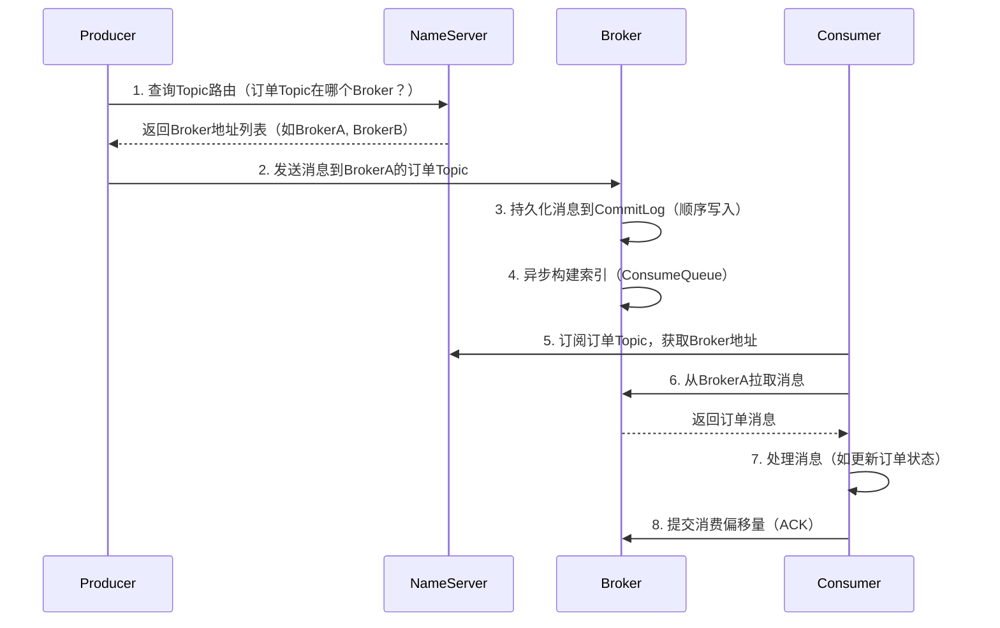
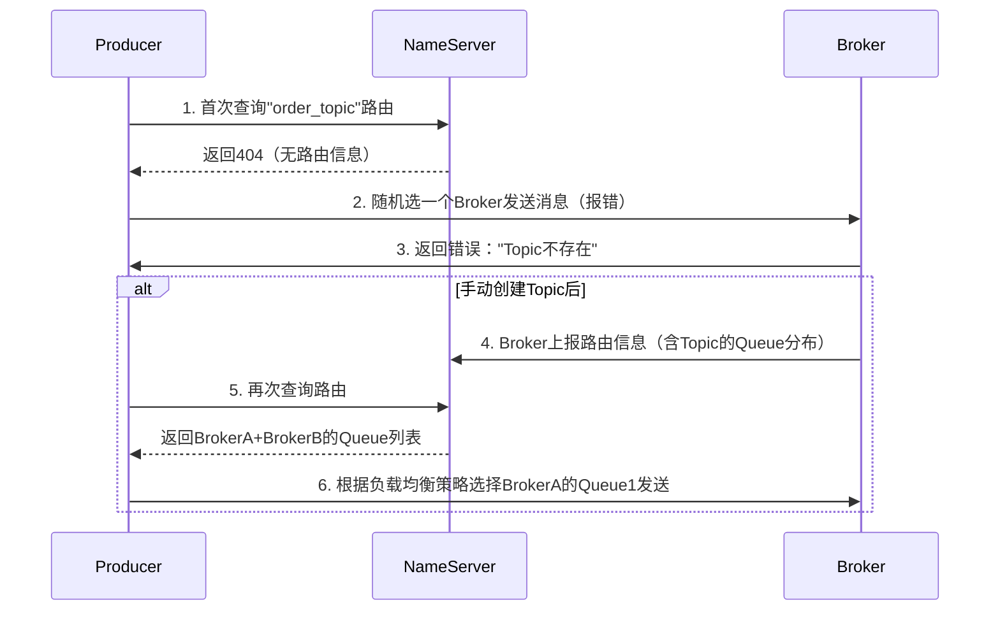
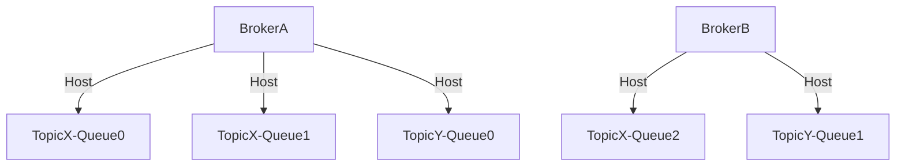
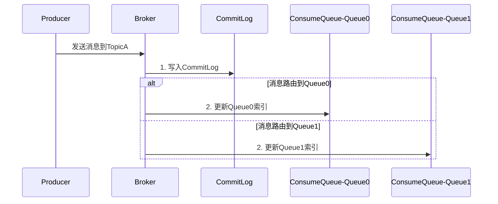
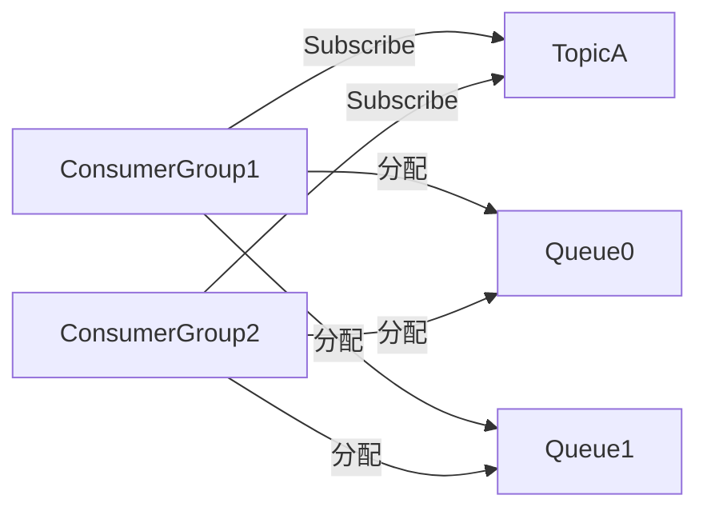
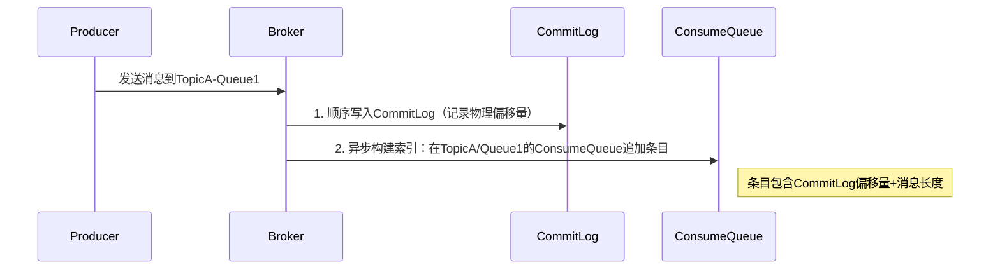
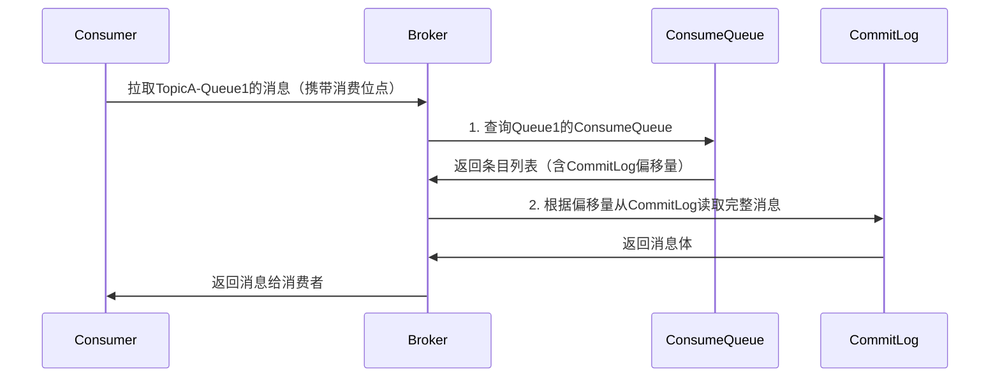
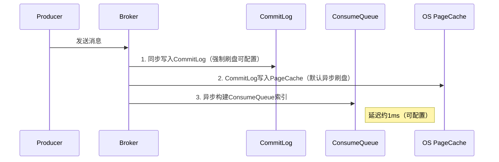
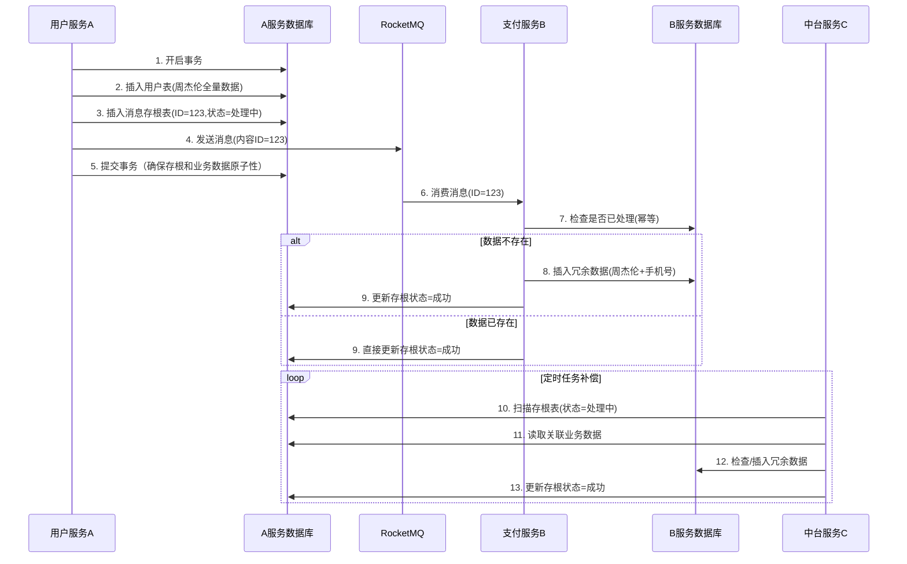
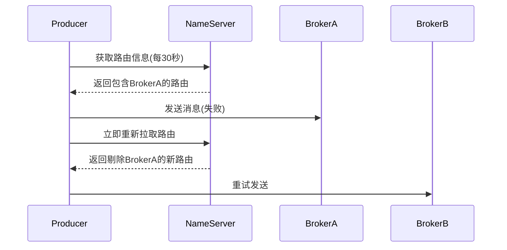

RocketMQ 是一款高性能、高可用的分布式消息中间件，广泛应用于异步通信、削峰填谷等场景。本文介绍 RocketMQ 的核心概念、架构设计及基本使用方式，帮助开发者快速上手并理解其核心优势。

<!-- more -->

***

## 前言

### 消息队列

消息队列(Message Queue)是一种应用程序对应用程序的通信方式，主要用于解决**应用解耦、异步消息、流量削峰**等问题。消息队列是一种“先进先出”的数据结构


### MQ 应用场景

| **解耦** | **把消息写入消息队列，需要的消息的应用可以直接订阅改队列，不需要代码的藕合**           |
| ------ | -------------------------------------------------- |
| **削峰** | **前端发送大量的请求，我们只需要把消息扔到消息队列，然后按照一定的速度去消费。避免了数据库压垮** |
| **异步** | **发送消息到队列就可以结束。不需要等待下游接口同步处理返回结果。**                |

### MQ 的优点和缺点

- 优点：解耦、削峰、数据分发

- 缺点包含以下几点：

  - 系统可用性降低：系统引入的外部依赖越多，系统稳定性越差。一旦 MQ 宕机，就会对业务造成影响。

  - 系统复杂度提高：MQ 的加入大大增加了系统的复杂度，以前系统间是同步的远程调用，现在是通过 MQ 进行异步调用。

  - 一致性问题：A 系统处理完业务，通过 MQ 给 B、C、D 三个系统发消息数据，如果 B 系统、C 系统处理成功，D 系统处理失败。

- 需要解决的问题

  - 如何保证 MQ 的高可用？

  - 如何保证消息没有被重复消费？怎么处理消息丢失情况？那么保证消息传递的顺序性？

  - 如何保证消息数据处理的一致性？

### RocketMQ vs Kafka vs RabbitMQ

| 特性   | RocketMQ   | Kafka      | RabbitMQ |
| :--- | :--------- | :--------- | :------- |
| 开发语言 | Java       | Scala/Java | Erlang   |
| 吞吐量  | 高(10 万+/秒) | 极高(百万/秒)   | 中(万级/秒)  |
| 延迟   | 毫秒级        | 毫秒级        | 微秒级      |
| 可靠性  | 高          | 高          | 高        |
| 消息顺序 | 分区有序       | 分区有序       | 队列有序     |
| 消息回溯 | 支持         | 支持         | 不支持      |
| 协议支持 | 自定义协议      | 自定义协议      | AMQP     |
| 适用场景 | 金融/电商      | 日志处理       | 企业应用     |

|   对比项  |   Kafka   |   RocketMQ   | RabbitMQ |
| :----: | :-------: | :----------: | :------: |
|  顺序消息  |     支持    |      支持      | 支持（需单队列） |
|  延时消息  |    不支持    | 支持（特定 Level） | 不支持（需插件） |
|  事务消息  |    不支持    |      支持      |    不支持   |
|  消息过滤  |  支持（消费者端） |  支持（Tag/SQL） |    不支持   |
|  消息查询  |    不支持    |      支持      |    不支持   |
| 消费失败重试 | 不支持（需自实现） |      支持      |    支持    |
|  批量发送  |     支持    |      支持      |    不支持   |

### MQ 的选择

- Kaka：Kafka 的主要特点是基于 pull 的模式来处理消息，追求吞吐量，一开始的目的就是用于日志收集和传输，适合产生了大量数据的互联网服务的数据收集业务。大型公司建议选用，如果有日志收集功能，首选 Kafka 。
- RocketMQ：天生为金融互联网领域而生，对于可靠性要求很高的场景，尤其是电商里面的订单扣款，以及业务削峰，在大量交易涌入的时候，后端可能无法及时处理的情况。RocketMQ 在稳定性上可能更值得信赖，因为这些场景在阿里的双 11 经历了多次考验。
- RabbitMQ：结合 Erlang 语言本身的并发优势，性能好，时效性 us 级，社区活跃度高，管理界面用起来十分方便，中小型公司优先选择功能完备的 RabbitMQ 。

## RocketMQ 介绍

RocketMQ 文档：

- <https://rocketmq.apache.org/zh/docs/4.x/>

- [5.X 版本 快速开始 | RocketMQ (apache.org)](https://rocketmq.apache.org/zh/docs/quickStart/01quickstart/)

### 演进历程

RocketMQ 是一款开源的 **分布式消息中间件**，由阿里巴巴团队最初开发，并于 2017 年捐赠给 Apache 基金会，成为 Apache 顶级项目（Top-Level Project）。它被设计用于处理高吞吐、低延迟、高可用的消息通信场景，广泛应用于分布式系统中的异步解耦、流量削峰、数据同步等场景。

### 核心特性

1. **高吞吐与低延迟**
   - 支持单机每秒百万级消息吞吐，毫秒级延迟，适合大规模实时数据处理。
   - 采用零拷贝（Zero-Copy）和顺序写盘等技术优化性能。
2. **分布式架构**
   - 支持多主多从部署模式，具备水平扩展能力。
   - 通过 **NameServer** 实现轻量级服务发现，Broker（消息存储节点）可动态扩缩容。
3. **消息可靠性**
   - 提供持久化存储、消息重试、事务消息等机制，确保消息不丢失。
   - 支持同步/异步刷盘、主从同步/异步复制策略。
4. **丰富的消息模式**
   - **发布/订阅**：支持 Topic 和 Tag 的灵活消息路由。
   - **顺序消息**：保证同一队列内消息的顺序性（如订单场景）。
   - **定时/延迟消息**：支持消息延迟投递（如秒杀场景）。
   - **事务消息**：通过两阶段提交（2PC）实现分布式事务最终一致性。
5. **多语言支持**
   - 提供 Java、C++、Go、Python 等客户端，支持跨平台调用。
6. 运维管理：5.0 版本强化 Topic 与消息类型的强制关联，避免混乱。

### 核心概念

1. 主题(Topic)

   - 消息传输和存储的顶层容器，通过 TopicName 唯一标识，代表一类业务逻辑的消息。

2. 消息类型(MessageType)

   - 按传输特性分类，包括：普通消息、顺序消息、事务消息、定时/延时消息。

   - 注意：从 5.0 版本起，强制每个 Topic 仅允许一种消息类型（默认开启校验，兼容 4.x 行为）。

3. 消息队列(MessageQueue)

   - 实际存储和传输消息的容器，是消息的最小存储单元。

   - Topic 由多个队列组成，通过 QueueId 标识，支持水平扩展。

4. 消息(Message)

   - 最小数据传输单元，包含业务数据负载和扩展属性。

5. 消息标签(MessageTag)
   - 细粒度分类属性，消费者可订阅特定标签实现过滤。

### 生产者相关概念

- 生产者(Producer)：构建并发送消息到服务端的运行实体。

- 事务消息：

  - 事务检查器(TransactionChecker)：检查本地事务状态的监听器。

  - 事务状态(TransactionResolution)：包括提交、回滚、未决三种状态，控制消息投递。

### 消费者相关概念

1. 消费者分组(ConsumerGroup)
   - 逻辑分组，承载多个行为一致的消费者，实现负载均衡和高可用。
2. 消费者(Consumer)
   - 接收和处理消息的运行实体，返回消费结果(ConsumeResult)（成功/失败）。
3. 订阅关系(Subscription)
   - 定义消息获取规则（如标签过滤）、消费进度维护等。
4. 消费位点(ConsumerOffset)
   - 记录消费者分组的最新消费位置，支持重置消费位点（按时间重新设置进度）。

### 消息控制类型

- 顺序消息：保证消息按发送顺序被消费。

- 定时/延时消息：指定时间后才可被消费。

- 消息过滤：服务端根据标签过滤消息。

- 消息轨迹：追踪消息从生产到消费的完整链路，便于排查问题。

- 消息堆积：因消费能力不足导致消息在服务端积压。

## RocketMQ 架构设计

|         组件        |                         作用                         |         类比解释        |
| :---------------: | :------------------------------------------------: | :-----------------: |
|    **Producer**   |                    消息生产者，创建并发送消息                   |        快递发货方        |
|    **Consumer**   |                    消息消费者，订阅并消费消息                   |        快递收货方        |
|     **Topic**     |                消息的逻辑分类（如：订单消息/支付消息）                | 快递的"物品类型"（如电子产品/生鲜） |
|     **Broker**    |             消息存储和转发的核心服务器，负责持久化消息、负载均衡等            |        快递分拣中心       |
|   **NameServer**  |          轻量级注册中心，管理 Broker 的路由信息（不参与消息存储）          |     快递公司的"导航系统"     |
| **Message Queue** | Topic 下的物理分区，每个 Queue 并行存储消息（类似 Kafka 的 Partition） |      分拣中心的传送带通道     |


### NameServer（命名服务）

- **角色**：轻量级服务注册与发现中心，负责管理 Broker 的元数据（路由信息）。
- **核心功能**：
  - **服务发现**：Producer 和 Consumer 通过 NameServer 获取 Broker 的地址列表。
  - **心跳检测**：Broker 定期向 NameServer 发送心跳，NameServer 监控 Broker 的存活状态。
  - **无状态设计**：NameServer 节点之间不通信，无主从之分，部署简单且扩展性强。
- **特点**：
  - 低延迟：直接维护 Broker 的 IP 和 Topic 路由表，快速响应客户端查询。
  - 高可用：多 NameServer 节点部署避免单点故障。

### Broker（消息存储与转发节点）

- **角色**：消息存储和传输的核心节点，负责接收、持久化、投递消息。
- **核心功能**：
  - **消息存储**：
    - 所有消息按顺序写入 **CommitLog**（物理日志文件），保证高性能写入。
    - 通过 **Consumer Queue**（逻辑队列）按 Topic 和 Queue 组织消息，实现高效消费。
  - **消息投递**：根据 Consumer 的订阅关系推送或拉取消息。
  - **高可用机制**：
    - **主从架构**：Master 负责读写，Slave 作为备份（支持同步/异步复制）。
    - **故障切换**：Master 宕机时，Slave 可自动或手动提升为新的 Master。
- **关键配置**：
  - **刷盘策略**：
    - 同步刷盘（可靠性优先）：消息写入磁盘后才返回成功，保证数据不丢失。
    - 异步刷盘（性能优先）：消息写入内存即返回，后台线程异步刷盘。
  - **复制策略**：
    - 同步复制（强一致）：消息写入 Slave 后才返回成功。
    - 异步复制（高吞吐）：消息写入 Master 即返回，异步复制到 Slave。

### Producer（消息生产者）

- **角色**：向 Broker 发送消息的客户端。
- **核心功能**：
  - **消息发送模式**：
    - **同步发送**：等待 Broker 返回确认，保证消息可靠（例如支付场景）。
    - **异步发送**：通过回调处理结果，提高吞吐量（例如日志收集）。
    - **单向发送**：不等待响应，适用于可容忍少量丢失的场景（如监控数据）。
  - **负载均衡**：自动选择 Broker 的队列（Queue）发送消息，支持轮询、哈希等策略。
  - **事务消息**：通过两阶段提交（2PC）实现分布式事务（如订单创建后扣减库存）。

### Consumer（消息消费者）

- **角色**：从 Broker 订阅并消费消息的客户端。
- **核心功能**：
  - **消费模式**：
    - **Push 模式**：Broker 主动推送消息给 Consumer（默认模式，简化开发）。
    - **Pull 模式**：Consumer 主动拉取消息（更灵活，需自行控制频率）。
  - **消费策略**：
    - **集群消费（Clustering）**：同一 Consumer Group 内的多个实例负载均衡消费消息（如订单处理）。
    - **广播消费（Broadcasting）**：消息发送给所有 Consumer 实例（如配置更新）。
  - **消息重试**：
    - 消费失败时自动重试（默认重试 16 次，间隔逐渐增加）。
    - 支持自定义重试队列（如将失败消息投递到死信队列）。

### Topic（主题）与 Queue（队列）

- **Topic**：消息的逻辑分类，Producer 发送消息到指定 Topic。
- **Queue**：
  - Topic 的物理分区，每个 Topic 可划分为多个 Queue。
  - 消息在 Queue 内保证顺序性（顺序消息需指定相同 Sharding Key）。
  - 支持水平扩展：增加 Queue 数量可提升 Topic 的并发处理能力。

### 组件协作流程

1. **启动流程**：
   - Broker 启动后向所有 NameServer 注册路由信息。
   - Producer/Consumer 启动时从 NameServer 拉取 Broker 的路由表。
2. **消息发送**：
   - Producer 根据 Topic 的路由信息选择 Broker 的 Queue 发送消息。
3. **消息消费**：
   - Consumer 从 Broker 订阅消息，Broker 根据消费进度（Offset）推送消息。
   - Consumer 定期提交 Offset 以记录消费位置。

## 消息数据流转过程




同步：开启先线程 持久化 消息到磁盘 【主线程阻塞等待】把消息返给生产者。内存-磁盘
异步：不等待子线程执行完成就 返回结果了给生产者。 flushDiskType = ASYNC\_FLUSH
commitlog:文件大小是一定的，可能有多个。
consumeQueue:hash 实体地址
消息重试：ConsumeConcurrentlyStatus.RECONSUME\_LATER ：重试次数：默认是 16 次数可以配置的
1,3,4,20 1 分钟 3 分钟 大约是 16 次 4 个小时
丢到死信队列：消息消费不了，人工处理：3 天之后会消息默认删除掉

## Topic 的创建与 Broker 分配机制

RocketMQ 中 Topic 的创建与 Broker 分配机制是动态协调的

### 常见误区

- 常见误区：开发者误以为`producer.send()`时自动创建 Topic。

- 真相：代码中发送消息时不会自动创建 Topic,**必须提前在 Broker 上创建 Topic**（代码发送时仅指定名称），否则会报错：

  ```sh
  CODE: 17  DESC: No topic route info in name server
  ```

### Topic 的两种创建方式

| 方式        | 操作步骤                                                                 | 适用场景         |
| --------- | -------------------------------------------------------------------- | ------------ |
| 手动创建（推荐）  | 通过命令行或控制台预先创建： `mqadmin updateTopic -t order_topic -b broker1:10911` | 生产环境         |
| 自动创建（风险高） | 修改 Broker 配置： `autoCreateTopicEnable=true`                           | 测试环境（可能引发混乱） |

### Topic 路由信息的动态获取流程

当 Producer 发送消息时，如何知道 Topic 在哪个 Broker？以下是详细交互过程：



### 路由信息的核心数据结构

NameServer 中存储的 Topic 路由信息实际是 Queue 与 Broker 的映射关系，例如：

```json
{
  "order_topic": {
    "queueDatas": [
      {
        "brokerName": "broker-a",
        "queueId": 0  // Queue0在BrokerA上
      },
      {
        "brokerName": "broker-a",
        "queueId": 1  // Queue1在BrokerA上
      },
      {
        "brokerName": "broker-b",
        "queueId": 0  // Queue0在BrokerB上
      }
    ]
  }
}
```

### 生产环境最佳实践

1. 预先规划 Topic 与 Broker 分配 ​

   ```sh
   # 创建Topic时明确指定Broker和Queue数量
   mqadmin updateTopic -n nameserver:9876 -t order_topic \
     -b broker-a:10911 -r 8 -w 8  # 在BrokerA上建8个读写队列

   mqadmin updateTopic -n nameserver:9876 -t order_topic \
     -b broker-b:10911 -r 8 -w 8  # 在BrokerB上再建8个队列（共16个）
   ```

2. 代码中获取路由信息（调试用）

   ```sh
   TopicRouteData route = producer.getDefaultMQProducerImpl()
       .getmQClientFactory()
       .getMQClientAPIImpl()
       .getTopicRouteInfoFromNameServer("order_topic", 3000);

   route.getQueueDatas().forEach(q -> {
       System.out.println("Broker: " + q.getBrokerName() + " QueueID: " + q.getQueueId());
   });
   ```

3. 动态感知路由变化

   - Producer/Consumer：每 30 秒从 NameServer 拉取最新路由（可配置）
   - Broker 下线：NameServer 通过心跳检测移除失效节点，客户端下次请求时获取新路由

## 多 Broker 场景如何选择目标 Broker

- 负载均衡：Producer 根据`MessageQueueSelector`策略选择 Queue（默认轮询）

- 默认策略：轮询（Round Robin）

  - 特点：均匀分布消息，避免单 Broker 过载。
  - 局限：无法感知 Broker 负载状态（如 CPU、磁盘压力）。

  ```sh
  // 生产者默认行为：轮询选择Topic下的所有Broker
  public SendResult send(Message msg) {
      List<MessageQueue> queues = fetchPublishInfo(msg.getTopic()).getMessageQueueList();
      int index = incrementAndGet() % queues.size(); // 轮询下标
      return send(msg, queues.get(index));
  }
  ```

- **基于 Queue 的选择**,路由逻辑：

  - 先选 Queue，再关联到对应 Broker（Queue 与 Broker 绑定）。

  ```mermaid
  graph TD
      TopicA -->|包含| Queue0(BrokerA-Queue0)
      TopicA -->|包含| Queue1(BrokerA-Queue1)
      TopicA -->|包含| Queue2(BrokerB-Queue0)
      TopicA -->|包含| Queue3(BrokerB-Queue1)
      Producer -->|选择Queue2| BrokerB
  ```

- 延迟敏感策略

  - 适用场景：跨机房部署时，优先选择网络延迟低的 Broker。

    ```java
    // 优先选择低延迟Broker（需自定义Selector）
    public class LowLatencySelector implements MessageQueueSelector {
        @Override
        public MessageQueue select(List<MessageQueue> mqs, Message msg, Object arg) {
            Map<MessageQueue, Long> latencyMap = getBrokerLatencies(); // 实时监控数据
            return latencyMap.entrySet().stream()
                    .min(Map.Entry.comparingByValue())
                    .map(Map.Entry::getKey)
                    .orElse(mqs.get(0));
        }
    }
    ```

- 权重分配

  - • 实现原理：修改`TopicPublishInfo`中的 Queue 分布比例。

  ```properties
  # Broker权重配置（通过NameServer传递）
  brokerClusterName=DefaultCluster
  broker-A=weight=10
  broker-B=weight=5  # BrokerB的流量将比BrokerA少50%

  ```

- 故障规避

  - 触发条件：当 Broker 响应超时或返回 SLAVE\_NOT\_AVAILABLE 错误码时。

  ```java
  // 排除不可用Broker（需集成健康检查）
  List<MessageQueue> availableQueues = mqs.stream()
          .filter(q -> !isBrokerDead(q.getBrokerName()))
          .collect(Collectors.toList());
  ```

### 生产环境最佳实践

**​(1) 跨机房流量调度 ​**​

| 策略     | 配置示例                                       | 效果                         |
| ------ | ------------------------------------------ | -------------------------- |
| 同机房优先  | `broker-a=zone=shanghai`                   | 上海机房 Producer 优先选本地 Broker |
| 手动指定路由 | `producer.setSendLatencyFaultEnable(true)` | 自动避开高延迟节点                  |

**(2) 动态感知与调整**

• `-b`：指定新 Broker 地址

• `-r`：读队列数（需与`-w`写队列数一致）

```bash
# 通过Admin CLI强制切换Broker
mqadmin updateTopic -n nameserver:9876 -t TopicA -b broker-c:10911 -r 8 -w 8

# -b 指定新Broker地址
# -r：读队列数（需与`-w`写队列数一致）
```

**(3) 就近写入优化**

```properties
# 在Producer端配置网络探测
producer.setUnitName="shanghai-dc"  # 与Broker的zone匹配
rocketmq.client.region=ASIA
rocketmq.client.regionPreference=true
```

## Broker 管理 Queue

在 RocketMQ 的架构设计中，一个 Broker 内部会管理多个 Queue（队列），这是实现消息并行处理、负载均衡和高可用的核心机制。

### Queue 的基本概念

- 本质：Queue 是 Topic 在 Broker 上的物理分片（Partition），每个 Queue 对应一个 ConsumeQueue 索引文件。
- 作用：实现消息的并行存储和消费，不同 Queue 之间相互独立。

### Queue 数量设计公式

```sh
推荐Queue总数 = max(消费者数量 × 2, 业务峰值TPS / 单Queue承载能力)

# 示例：
# 消费者组有 8 个实例，峰值 TPS 100,000 → 至少 16 个 Queue
# 单 Queue 建议承载 ≤ 5,000 TPS（SSD 磁盘）
```

### Queue 关键特性

| 特性   | 说明                                    |
| ---- | ------------------------------------- |
| 顺序性  | 单个 Queue 内消息严格 FIFO（全局顺序需单 Queue 单线程） |
| 水平扩展 | 增加 Queue 数量可提升 Topic 的吞吐量             |
| 负载均衡 | 生产者/消费者可均匀分布到不同 Queue                 |

```sh
# 动态增加Topic的Queue数量（无需重启）
mqadmin updateTopic -n nameserver:9876 -t TopicA -c DefaultCluster -w 8
# 影响：新增 Queue 只对后续消息生效，旧 Queue 仍继续服务。
```

### Queue 与 Broker 的关系

**配置参数**：

```properties
# Broker配置文件（broker.conf）
brokerClusterName=DefaultCluster
brokerName=BrokerA
# 默认每个Topic的Queue数量（可动态调整）
defaultTopicQueueNums=4
```

**规则**：

- 一个 Topic 的 Queue 会分散在多个 Broker（如 TopicX 有 3 个 Queue，分布在 BrokerA 和 BrokerB）。
- 单个 Broker 可同时服务多个 Topic 的 Queue。



### Queue 的文件存储结构

- 写入：多 Queue 可并行追加 CommitLog（相同 Topic 的 Queue 共享 CommitLog 文件）。
- 消费：消费者组的不同消费者可同时拉取不同 Queue（一个 Queue 只能被一个消费者线程占用）。

```bash
# Broker存储目录示例
├── commitlog/           # 所有消息的物理存储
│   └── 00000000000000000000
├── config/
├── consumequeue/
│   ├── TopicA/          # 每个Topic独立目录
│   │   ├── 0/          # Queue0的ConsumeQueue
│   │   │   └── 00000000000000000000
│   │   ├── 1/          # Queue1的ConsumeQueue
│   │   └── ...
│   └── TopicB/
│       ├── 0/
│       └── ...
└── index/
```

### 关键组件协作



### Queue 与消费者的关系

**消费组分配规则**

- 同一消费组的消费者平均分配 Queue（如 2 个消费者消费 4 个 Queue，每人 2 个）。
- 不同消费组独立消费（如 Group1 和 Group2 各自全量消费 TopicA）。
- **一个 Queue 在同一时刻只能被一个消费者线程消费**

| 场景               | 限制条件                |
| ---------------- | ------------------- |
| 消费者数量 > Queue 数量 | 多余的消费者将闲置（确保不重复消费）  |
| 顺序消费             | 必须单消费者单线程处理整个 Queue |



## 消息存储的核心数据结构

在 RocketMQ 中，CommitLog 和 ConsumeQueue 是消息存储的核心数据结构，它们共同协作实现高性能的消息持久化与快速消费。以下是详细解析：

***

### CommitLog：消息的原始存储

- 所有 Topic 的消息混合顺序写入的物理文件（类似日志文件）。

- 存储内容：

  ```java
  // 消息格式示例（二进制存储）
  +---------+-----------+---------+------------+-----------+---------+
  | MsgSize | MagicCode | BodyCRC | QueueOffset| CommitLog | Body    |
  | (4字节) | (4字节)   | (4字节) | (8字节)    | Offset(8) | (实际数据)|
  +---------+-----------+---------+------------+-----------+---------+
  ```

- 关键特性：

  - 顺序写入：所有消息追加到文件末尾（磁盘顺序 I/O，性能极高）。
  - 不分 Topic：不同 Topic 的消息在 CommitLog 中混合存储。

> 文件组织

```bash
# Broker存储目录结构
store/
├── commitlog/
│   ├── 00000000000000000000  # 第一个文件（默认1GB）
│   ├── 00000000001073741824  # 第二个文件（偏移量1073741824=1GB）
│   └── ...
```

***

### ConsumeQueue：消息的逻辑索引

- 每个 Topic 的每个 Queue 对应的逻辑消费队列（类似数据库索引）。

- 存储内容（固定 20 字节/条）：

  ```java
  +------------+-----------+-------------+
  | CommitLog  | MsgSize   | MsgTagHash  |
  | Offset(8)  | (4字节)   | (8字节)     |
  +------------+-----------+-------------+
  ```

- 关键特性：

  - 轻量级：仅存储指向 CommitLog 的指针，不存消息体。

  - 分 Topic/Queue：每个 Queue 独立维护自己的 ConsumeQueue。

> 文件组织

```bash
store/
├── consumequeue/
│   ├── order_topic/  # Topic名称
│   │   ├── 0/        # Queue0的索引
│   │   │   ├── 00000000000000000000
│   │   │   └── ...
│   │   ├── 1/        # Queue1的索引
│   │   └── ...
│   └── pay_topic/
│       └── ...
```

***

### 写入流程 ​​



### 读取流程（消费者视角）



### 为什么这样设计？

**​ 性能优化 ​**​

| 设计选择             | 优势                         |
| ---------------- | -------------------------- |
| CommitLog 顺序写入   | 最大化磁盘 I/O 性能（600MB/s+写入速度） |
| ConsumeQueue 轻量化 | 内存映射文件（mmap）快速加载，减少磁盘随机读   |
| 读写分离             | 写入仅操作 CommitLog，消费通过索引跳转   |

**对比 Kafka 的 Partition 设计**

| RocketMQ          | Kafka               |
| ----------------- | ------------------- |
| CommitLog 全局混合存储  | 每个 Partition 独立日志文件 |
| ConsumeQueue 作为索引 | 直接读取 Partition 文件   |
| 更适合海量 Topic 场景    | Partition 过多时性能下降   |

### 消费者实际消费过程示例

```java
consumer.subscribe("order_topic", "*");
consumer.registerMessageListener((msgs, context) -> {
    for (MessageExt msg : msgs) {
        // 消息实际从CommitLog读取（对开发者透明）
        System.out.println("收到消息: " + new String(msg.getBody()));
    }
    return ConsumeConcurrentlyStatus.CONSUME_SUCCESS;
});
```

**底层动作**

1. 消费者向 Broker 请求`order_topic`的`Queue1`，位点为 100。

2. Broker 检查 `order_topic/1/`的 ConsumeQueue，找到位点 100 对应的条目：

   ```
   CommitLog Offset: 2500, MsgSize: 200
   ```

3. 从 CommitLog 文件的 2500 字节位置读取 200 字节，得到完整消息。

### 消息删除后空间如何回收？

- CommitLog：按文件过期删除（默认 72 小时），非实时删除单条消息。
- ConsumeQueue：随 CommitLog 清理同步删除索引条目。

## 消费位点

在 RocketMQ 中，消费位点（Consumer Offset） 是标记消费者组在某个 Queue 上消费进度的关键指标。消费位点值为 100 时，表示该消费者组已成功消费到该 Queue 的第 100 条消息（从 0 开始计数）。

### 位点的本质 ​

- 物理意义：消费位点是一个 64 位整数，通过映射对应 CommitLog 中的物理偏移量（`physicOffset`）。
- 逻辑意义：表示消费者组在某个 Queue 上已确认消费的最后一条消息的位置。
- 解耦设计：消费位点记录的是 ConsumeQueue 的偏移量，即使 CommitLog 文件滚动也不影响。
- 例如：位点=100 → 已消费消息 0\~100，下一条待消费的是 101。

### 位点存储位置

| 存储位置      | 描述                                                       |
| --------- | -------------------------------------------------------- |
| Broker 磁盘 | 持久化在 `${ROCKETMQ_HOME}/store/config/consumerOffset.json` |
| 内存缓存      | Broker 运行时维护在 `OffsetStore` 对象中                          |
| 消费者本地     | 集群模式下由 Broker 管理，广播模式存在消费者本地                             |

```sh
[rocketmq@381d55d95fa8 store]$ cat config/consumerOffset.json
{
	"offsetTable":{
	    # 例如：Queue 0 的位点为250 → 已消费到该Queue的第251条消息（Offset从0开始计数）。
		"TopicTest@please_rename_unique_group_name_4":{0:250,1:250,2:250,3:250
		},
		# 0：表示当前 没有待处理的重试消息（位点为0说明已消费完所有重试消息）。
		"%RETRY%please_rename_unique_group_name_4@please_rename_unique_group_name_4":{0:0
		}
	}

#Topic名称@消费者组名称	{QueueId:Offset}	表示该消费者组在指定Topic的某个Queue上的消费位点
＃%RETRY%消费者组名@消费者组名	{0:0}	表示该消费者组的重试队列（RETRY Topic）的消费位点
```

### 位点的具体来源

1. \*\*初始位点分配:\*\*当新的消费者组首次订阅时，位点由 `consumeFromWhere` 参数决定：

   ```java
   consumer.setConsumeFromWhere(ConsumeFromWhere.CONSUME_FROM_LAST_OFFSET); // 默认从最新位点
   ```

   | 配置选项                        | 行为                       |
   | --------------------------- | ------------------------ |
   | `CONSUME_FROM_LAST_OFFSET`  | 从 Queue 当前最大位点开始（跳过历史消息） |
   | `CONSUME_FROM_FIRST_OFFSET` | 从 0 开始（消费所有历史消息）         |
   | `CONSUME_FROM_TIMESTAMP`    | 从指定时间戳后的第一条消息开始          |

2. 若 Queue 已有消息：初始位点可能是 Queue 的最小偏移量（0）或最大偏移量（如 100）。

3. 消费者每次成功消费后，通过以下方式提交位点：

   ```java
   // RocketMQ核心提交逻辑（RemoteBrokerOffsetStore.class）
   public void updateOffset(MessageQueue mq, long offset, boolean increaseOnly) {
       if (mq != null) {
           AtomicLong offsetOld = this.offsetTable.get(mq);
           if (null == offsetOld) {
               offsetOld = this.offsetTable.putIfAbsent(mq, new AtomicLong(offset));
           }
           if (increaseOnly) { // 保证位点只增不减
               MixAll.compareAndIncreaseOnly(offsetOld, offset);
           } else {
               offsetOld.set(offset);
           }
       }
   }
   ```

   ```mermaid
   sequenceDiagram
       participant C as Consumer
       participant B as Broker
       C->>B: 拉取消息(Queue0, 当前位点=95)
       B-->>C: 返回消息96~100
       C->>C: 业务处理消息96~100
       C->>B: 提交新位点=100 (CONSUME_SUCCESS)
       B->>B: 更新consumerOffset.json
   ```

### 位点相关的运维操作

- **​ 查看消费位点 ​**​

  ```sh
  # 命令行查看特定消费者组的位点
  mqadmin queryConsumerOffset -n nameserver:9876 -g ConsumerGroupA -t TopicTest -i 0

  #输出示例：
  Broker: broker-a:10911
  QueueId: 0
  ConsumerOffset: 100  # 当前消费位点
  BrokerOffset: 150     # Queue最大位点
  Diff: 50              # 堆积量=150-100=50
  ```

- **手动重置位点**

  ```sh
  # 强制将位点重置为100（慎用！可能导致重复/丢失消息）
  mqadmin updateConsumerOffset -n nameserver:9876 -g ConsumerGroupA -t TopicTest -i 0 -o 100
  ```

- 监控消费延迟：

  ```sh
  # 定时采集Diff值（堆积量）
  mqadmin consumerProgress -n nameserver:9876 -g ConsumerGroupA | grep -v "0$"
  ```

- 避免位点丢失：

  - 启用 Broker 的高可用模式（主从同步 OffsetStore）。

  - 定期备份 `${ROCKETMQ_HOME}/store/config/consumerOffset.json`。

### 位点异常场景

| 现象       | 可能原因              | 解决方案                      |
| -------- | ----------------- | ------------------------- |
| 位点长时间不更新 | 消费者崩溃未提交或网络分区     | 检查消费者状态，重启异常实例            |
| 位点突然归零   | Broker 磁盘损坏或误操作重置 | 从备份恢复 consumerOffset.json |
| 位点跳跃式增长  | 手动修改或消息被批量跳过      | 检查业务逻辑和运维操作记录             |

### 位点与消息存储的映射关系

- CommitLog 物理存储

  ```sh
  # CommitLog文件结构（每条消息包含物理偏移量）
  00000000000000000000
  ├── MagicCode: 0xAABBCCDD
  ├── BodyLength: 100
  ├── Body: "HelloWorld"
  └── physicOffset: 100  # 本条消息的物理位点
  ```

- ConsumeQueue 索引

  ```sh
  # Queue索引条目结构（20字节/条）
  └── consumequeue/TopicA/0/00000000000000000000
      ├── offset: 100       # 逻辑位点
      ├── size: 128         # 消息大小
      └── physicOffset: 500 # 对应CommitLog的物理位点
  ```

- 关键映射：消费者看到的位点 100 → 通过 ConsumeQueue 找到 CommitLog 的 500 → 读取实际消息。

## **异步写入**与消费者读取一致性

### 异步刷盘流程 ​

- CommitLog 写入优先：消息必须先持久化到 CommitLog，才会触发 ConsumeQueue 更新。

- 最终一致性：ConsumeQueue 的延迟更新对消费者透明，通过以下机制保证正确性。



### 消费者如何安全读取？

1. **消费者位点管理 ​**​

   - 消费位点（Offset）：记录的是 ConsumeQueue 的物理位置（非 CommitLog 偏移量）。
   - 位点提交：消费者只有在成功处理消息后，才会提交位点到 Broker。

2. **读取时的保护机制**

   ```java
   // Broker端处理拉取请求的伪代码
   public PullResult pullMessage(String topic, int queueId, long offset) {
       // 步骤1：检查请求的offset是否合法
       if (offset < minQueueOffset || offset > maxQueueOffset) {
           return CODE: OFFSET_OVERFLOW; // 越界处理
       }

       // 步骤2：从ConsumeQueue读取条目
       ConsumeQueueItem item = consumeQueue.getItem(offset);
       if (item == null) {
           return CODE: OFFSET_NOT_FOUND; // 等待异步构建
       }

       // 步骤3：从CommitLog读取完整消息
       Message msg = commitLog.getMessage(item.commitLogOffset);
       return new PullResult(SUCCESS, msg);
   }


   // 消息对消费者可见的条件（必须同时满足）
   boolean isMessageVisible(long offset) {
       return offset <= maxQueueOffset &&    // 不超过最大位点
              commitLog.isFlushed(offset);   // CommitLog已刷盘（若配置同步刷盘）
   }
   ```

3. **关键保障措施**

   | 机制                | 作用                                              |
   | ----------------- | ----------------------------------------------- |
   | 最小物理位点（minOffset） | Broker 会记录 ConsumeQueue 的最小有效位点，拒绝读取未构建的 offset |
   | 最大物理位点（maxOffset） | 限制消费者不能读取超过最新位点                                 |
   | HA 同步机制           | 主从 Broker 间同步 ConsumeQueue 状态，防止主节点宕机导致数据不一致    |

### 极端情况处理

1. **消费者拉取时 ConsumeQueue 未更新**
   - 现象：消费者请求 offset=X，但 ConsumeQueue 条目尚未生成。
   - 处理：Broker 返回`OFFSET_NOT_FOUND`，客户端自动重试（默认等待 1 秒）。
2. **Broker 崩溃后恢复**
   - 恢复流程：
     - Broker 重启后检查 CommitLog 和 ConsumeQueue 的一致性。
     - 根据 CommitLog 重建缺失的 ConsumeQueue 条目（通过`ReputMessageService`服务）。

**4. 性能与一致性的权衡**

| 配置项                         | 一致性级别        | 性能影响       |
| --------------------------- | ------------ | ---------- |
| `flushDiskType=SYNC_FLUSH`  | 强一致（消息 0 丢失） | 吞吐量下降约 30% |
| `flushDiskType=ASYNC_FLUSH` | 最终一致（毫秒级延迟）  | 最高性能       |
| `brokerRole=SYNC_MASTER`    | 主从强同步        | 写入延迟增加     |

## RocketMQ 丢失消息


### 消息丢失原因及解决方案对比

|       **环节**      |        **RabbitMQ 消息丢失场景**       |                                  **RocketMQ 解决方案**                                  |
| :---------------: | :------------------------------: | :---------------------------------------------------------------------------------: |
| **生产者（Producer）** |        网络问题导致发送失败，生产者误以为成功       | **同步发送**：等待 Broker 写入磁盘后返回 ACK（`producer.send(msg, timeout)`） **事务消息**：半消息机制确保最终一致性 |
|   **Broker 服务端**  |           消息默认存内存，宕机后丢失          |       **同步刷盘**（`flushDiskType=SYNC_FLUSH`） **主从同步**（`brokerRole=SYNC_MASTER`）       |
| **消费者（Consumer）** | 消费失败或崩溃，未返回 ACK 导致消息重新入队（重复消费风险） |           **消费后手动提交位点**（`consumer.registerMessageListener`） **死信队列**处理失败消息          |

### RocketMQ 各环节配置优化

|   **环节**   |                            **配置/代码示例**                           |     **作用**    |
| :--------: | :--------------------------------------------------------------: | :-----------: |
|   **生产者**  |             `producer.setRetryTimesWhenSendFailed(3)`            |  发送失败自动重试 3 次 |
|            |         `producer.send(msg, new SendCallback() { ... })`         | 异步发送时通过回调确认结果 |
| **Broker** |           `broker.conf` 中设置 `flushDiskType=SYNC_FLUSH`           | 每条消息刷盘后返回 ACK |
|            |                     `brokerRole=SYNC_MASTER`                     |   主从节点同步复制消息  |
|   **消费者**  |            `consumer.setConsumeMessageBatchMaxSize(1)`           |  逐条消费便于精准 ACK |
|            | `consumer.registerMessageListener(new MessageListenerOrderly())` |  顺序消费时避免并发问题  |

### 业务表+定时任务补偿方案

方案适用场景

- **强一致性要求**：如支付、账户变更
- **跨服务数据同步**：主库到冗余库的同步
- **MQ 不可靠环境**：网络抖动或 Broker 不稳定的情况



1. 生产者端（用户服务 A）

|  步骤 |          操作          |        防丢失保障       |
| :-: | :------------------: | :----------------: |
| 1-3 |    本地事务插入用户表+消息存根表   |     数据库事务保证原子性     |
|  4  | 发送 MQ 消息（消息体仅含业务 ID） | 存根表记录完整数据，MQ 消息可丢失 |
|  5  |         事务提交         |   存根和业务数据同时成功或失败   |

2. 消费者端（支付服务 B）

|  步骤 |         操作         |      防丢失保障      |
| :-: | :----------------: | :-------------: |
| 6-7 | 消费消息后检查存根状态和数据是否存在 |   幂等设计（避免重复插入）  |
| 8-9 |     插入数据并更新存根状态    | 存根状态更新需与消费逻辑同事务 |

**3. **补偿端**（中台服务 C）**

|   步骤  |        操作        |    防丢失保障    |
| :---: | :--------------: | :---------: |
| 10-13 |    定时扫描处理中的存根    | 最终一致性（兜底机制） |
|       | 根据存根数据修复消费者端缺失数据 |   自动重试直至成功  |

## RocketMQ 重复消费问题

### 幂等性（Idempotence）

即多次执行产生的影响与一次执行相同。补充：幂等性不仅限于 SQL，也适用于 API 设计、消息队列等场景（如消费者需处理重复消息）。例如：

```sql
# 无论执行多少次，结果都是 `status` 被设为 `'done'`，符合幂等性。
UPDATE table SET status = 'done' WHERE id = 1;
```

### 消息消费的 ACK 机制

在 RocketMQ 中，ACK（Acknowledgment，确认机制）是消费者处理完消息后向 Broker 发送的确认信号，表示该消息已被成功消费。Broker 收到 ACK 后，会将该消息标记为“已消费”，后续不再投递给消费者。

- ACK 机制的工作流程

  1. Broker 推送消息：Broker 将消息推送给消费者（Push 模式）或消费者主动拉取（Pull 模式）。
  2. 消费者处理消息：消费者收到消息后执行业务逻辑（如数据库更新、RPC 调用等）。
  3. 发送 ACK 确认：
     - 若业务处理成功，消费者发送 CONSUME\_SUCCESS（消费成功）ACK 给 Broker。
     - 若处理失败（如数据库异常），消费者返回 RECONSUME\_LATER（稍后重试），Broker 会稍后重新投递。
  4. Broker 更新消费进度：Broker 收到 ACK 后，更新消费偏移量（offset），标记该消息为“已消费”，后续不再投递。

- ACK 失败的可能情况

  - 消费者崩溃：消费者处理完消息但未发送 ACK（如进程被 kill）。
  - 网络问题：ACK 消息丢失，Broker 未收到确认。
  - 超时未 ACK：消费者处理时间过长，Broker 触发重试机制。
  - **结果：Broker 未收到 ACK 时，会重新投递该消息（导致重复消费）。**

- 注意：

  - 删除时机：RocketMQ 不会立即物理删除消息，而是标记为不可消费（逻辑删除），后续通过压缩或清理机制物理删除。

### RocketMQ 的“至少投递一次”原则

RocketMQ 的设计目标是**确保消息不丢失**，因此采用“至少投递一次”策略，即消息可能被多次投递给消费者，但绝不会丢失。

> **如何保证“至少投递一次”？**

- **生产者端**：采用同步发送 + 重试机制，确保消息到达 Broker。
- **Broker 端**：持久化存储 + 主从同步，即使 Broker 崩溃也能恢复消息。
- **消费者端**：ACK 机制 + 重试策略，确保消息被处理。

> 可能因以下场景重复：

- 生产者重试：发送消息未收到 Broker 确认（如网络抖动），生产者重试。
- Broker 持久化：Broker 收到重复消息（相同 Message ID）会去重，但极端情况（如主从切换）可能重复。
- 消费者重试：消费者处理超时或 ACK 丢失，Broker 重新投递。
- 重复的根本原因是分布式系统的不确定性（网络分区、节点故障等）。

### 导致消息重复的原因

1. **生产者重复发送**
   - 生产者发送消息后未收到 Broker 的确认（如网络超时），触发重试机制，导致 Broker 收到重复消息。
   - RocketMQ 通过 `Message ID` 去重，但极端情况（如主从切换）仍可能重复。
2. **Broker 存储冗余**
   - 在同步刷盘或主从复制时，若 Broker 未及时响应生产者，可能导致消息重复存储。
3. **消费者重复消费**
   - 消费者处理成功但 ACK 丢失，Broker 重新投递消息。
   - 消费者返回 `RECONSUME_LATER`，Broker 稍后重试。

### 解决方案

|   **环节**  |                       **原因**                      |       **消息特征**      |        **解决方案**        |
| :-------: | :-----------------------------------------------: | :-----------------: | :--------------------: |
| **生产者重复** |       - 网络超时未收到 Broker 确认 - Broker 响应延迟触发重试       | 相同 `Message ID` 的消息 |         - 业务层去重        |
| **消费端重复** | - ACK 丢失（网络/消费者崩溃） - 显式重试（`RECONSUME_LATER`） - 超时 | 相同 `Message ID` 的消息 | - 消费者幂等处理（唯一 ID、锁、乐观锁） |

- **基于 Message ID 的 Broker 端去重**
  - RocketMQ Broker 会为每条消息生成唯一 `Message ID`（或由生产者指定），并在存储时检查重复。若 `Message ID` 已存在，则拒绝重复消息。
- 消费者：基于 Redis/DB 的唯一键去重。

### 业务代码+redis 去重方案

- messageid 由于重复不能作为幂等处理的唯一标记。

  ```java
  <dependency>
      <groupId>org.springframework.boot</groupId>
      <artifactId>spring-boot-starter-redis</artifactId>
      <version>1.4.1.RELEASE</version>
  </dependency>
  ```

- **消费者处理幂等**

  ```java
  for (int i=0;i<list.size();i++){
      MessageExt messageExt = list.get(i);
      Boolean isExit = stringRedisTemplate.hasKey("消费组" + messageExt.getMsgId() + messageExt.getKeys());
      //查看是否在redis存在key
      if(!isExit){
          //增删改差  消费操作
          MessageExt messageExt = list.get(0);
          //String topic = messageExt.getTopic();
          //String tags = messageExt.getTags();
          //String keys = messageExt.getKeys();
          //String body = new String(messageExt.getBody(),"utf-8");
          //System.out.println("线程名"+Thread.currentThread().getName()+"消息主题："+topic+"过滤标签："+tags+"唯一值："+keys+"内容："+body);
          //Ack应答
          //ConsumeConcurrentlyStatus.CONSUME_SUCCESS; 表示成功
          //ConsumeConcurrentlyStatus.RECONSUME_LATER; 消息重试
          //修改状态是2
          //存入到redis中存储3天，3天后自动删除
          stringRedisTemplate.opsForValue().setIfAbsent("消费组" + messageExt.getMsgId() + messageExt.getKeys(),
                                                        String.valueOf(System.currentTimeMillis()),3, TimeUnit.DAYS);
      }
      return ConsumeConcurrentlyStatus.CONSUME_SUCCESS;
  ```

## 消费者核心参数配置

RocketMQ 消费者的性能和行为可以通过以下几个关键参数控制，具体配置需结合业务场景（如消息处理耗时、网络带宽、系统负载等）

### 消费者线程数（并发消费能力）

- 参数：`consumeThreadMin` 和 `consumeThreadMax`

- 作用：消费者使用线程池处理消息，`consumeThreadMin` 是最小线程数，`consumeThreadMax` 是最大线程数。
  • 默认值：最小线程数：`20` 最大线程数：`20`（默认固定线程池）

- 适用场景：

  ```sh
  CPU 密集型（如复杂计算）：线程数 ≈ CPU 核心数。
  I/O 密集型（如数据库操作、远程调用）：可适当增大线程数（如 50~100）。
  ```

- 配置示例：

  ```java
  DefaultMQPushConsumer consumer = new DefaultMQPushConsumer("group");
  consumer.setConsumeThreadMin(20);     // 最小线程数
  consumer.setConsumeThreadMax(50);     // 最大线程数
  ```

### 单次拉取消息条数（网络效率优化）

- 参数：`pullBatchSize`, 默认值：`32`

- 作用：消费者每次从 Broker 拉取消息的最大条数（仅对 Pull 模式有效，Push 模式内部基于 Pull 封装）。

- 建议值：

  ```sh
  消息体较小时（如 1KB）：可增大到 `100~200`，减少网络交互次数。
  消息体较大时（如 10MB）：需调小（如 `10~20`），避免内存溢出或网络阻塞。
  ```

- 配置示例：

  ```sh
  consumer.setPullBatchSize(100);  // 每次最多拉取 100 条消息
  ```

### 单次消费消息条数（批量处理能力)

- 参数：`consumeMessageBatchMaxSize` , 默认值：`1`（逐条处理）

- 作用：消费者单次批量处理的消息条数（需结合批量消费接口使用）。

- 适用场景：

  - 批量更新数据库、批量发送通知等场景，可提升吞吐量。
  - 注意：需业务代码支持批量处理，并确保幂等性。

- 配置示例：

  ```java
  consumer.setConsumeMessageBatchMaxSize(10);  // 每次批量处理 10 条消息
  ```

### 完整配置示例

```java
DefaultMQPushConsumer consumer = new DefaultMQPushConsumer("group");
consumer.setNamesrvAddr("127.0.0.1:9876");
consumer.subscribe("TopicTest", "*");

// 线程池配置
consumer.setConsumeThreadMin(20);
consumer.setConsumeThreadMax(50);

// 拉取和消费配置
consumer.setPullBatchSize(100);               // 单次拉取 100 条
consumer.setConsumeMessageBatchMaxSize(10);   // 单次批量处理 10 条

// 超时和重试配置
consumer.setConsumeTimeout(15);              // 消费超时时间（分钟）
consumer.setMaxReconsumeTimes(3);            // 最大重试次数（默认 16 次）

consumer.registerMessageListener((List<MessageExt> msgs, ConsumeConcurrentlyContext context) -> {
    // 批量消费逻辑（需处理 msgs 列表）
    return ConsumeConcurrentlyStatus.CONSUME_SUCCESS;
});

consumer.start();
```

### ThreadPoolExecutor

**关键参数**

| 参数                | 说明                                                 | 示例值                                    |
| ----------------- | -------------------------------------------------- | -------------------------------------- |
| `corePoolSize`    | 核心线程数（长期存活的线程）                                     | `10`                                   |
| `maximumPoolSize` | 最大线程数（临时扩缩容）                                       | `50`                                   |
| `keepAliveTime`   | 空闲线程存活时间（秒）                                        | `60`                                   |
| `workQueue`       | 任务队列（`ArrayBlockingQueue` / `LinkedBlockingQueue`） | `new LinkedBlockingQueue<>(1000)`      |
| `handler`         | 拒绝策略（`AbortPolicy` / `CallerRunsPolicy`）           | `new ThreadPoolExecutor.AbortPolicy()` |

**示例代码**

```java
ThreadPoolExecutor executor = new ThreadPoolExecutor(
    10,                      // corePoolSize
    50,                      // maximumPoolSize
    60,                      // keepAliveTime (seconds)
    TimeUnit.SECONDS,
    new LinkedBlockingQueue<>(1000),  // 任务队列
    new ThreadPoolExecutor.AbortPolicy()  // 拒绝策略
);

// 提交任务
executor.execute(() -> {
    System.out.println("Task executed by thread: " + Thread.currentThread().getName());
});
```

### 线程池的配置？

```java
this.consumeExecutor = new ThreadPoolExecutor(
this.defaultMQPushConsumer.getConsumeThreadMin(),  20条
this.defaultMQPushConsumer.getConsumeThreadMax(),  20条
1000 * 60,                                         60秒
TimeUnit.MILLISECONDS,
this.consumeRequestQueue,                          无界队列：Integer.MAX_VALUE
new ThreadFactoryImpl("ConsumeMessageThread_"));    自定义线程工程
拒绝策略：丢弃任务抛出异常
```

> 总结：有坑：内存溢出。20 条线程。最大线程无意义

### 工作中

> 必须自定义这一块。

```java
/**
 *最小线程数：拉取的线程数量
 */
private int consumeThreadMin = 20;

/**
 *//自定义时：永远不会使用到
 */
private int consumeThreadMax = 20;

/**
* Message pull Interval  间隔时间
*/
private long pullInterval = 0;

/**
* Batch consumption size 配置成批量是：大于1：注意消息返回值，重复消费问题  全部重试，
*/
private int consumeMessageBatchMaxSize = 1;

/**
* Batch pull size 每条线程能拉取32个，可以修改消息数量
*/
private int pullBatchSize = 32;

/**
*阈值就不再拉取消息。1,2001  偏移量大于2000就不拉取消息了
*/
private int consumeConcurrentlyMaxSpan = 2000
```

- 大体：20 条线程去拉取消息：无界队列，内存溢出的风险【阈值就不再拉取消息】，

- 线程最大值无需配置无意义。一次拉取 32 个消息。每次消费是默认 1 个。无间断去拉取

### DefaultMQPushConsumer

- **​ 适用场景 ​**：​

  - 消息队列消费：RocketMQ 自动管理线程池，用于并发消费消息。
  - 无需手动管理线程池，但可以调整线程数、拉取策略等。

- **关键参数**

  | 参数                           | 说明      | 默认值  | 推荐调整值           |
  | ---------------------------- | ------- | ---- | --------------- |
  | `consumeThreadMin`           | 最小消费线程数 | `20` | `CPU 核心数 × 2`   |
  | `consumeThreadMax`           | 最大消费线程数 | `20` | `CPU 核心数 × 4`   |
  | `pullBatchSize`              | 单次拉取消息数 | `32` | `50~200`（视消息大小） |
  | `consumeMessageBatchMaxSize` | 单次消费消息数 | `1`  | `1~50`（批量消费时调整） |

- **示例代码**

  ```java
  DefaultMQPushConsumer consumer = new DefaultMQPushConsumer("group");
  consumer.setNamesrvAddr("127.0.0.1:9876");
  consumer.subscribe("TopicTest", "*");

  // 调整线程池参数
  consumer.setConsumeThreadMin(20);  // 最小线程数
  consumer.setConsumeThreadMax(50);  // 最大线程数

  // 调整拉取和消费策略
  consumer.setPullBatchSize(100);  // 单次拉取 100 条
  consumer.setConsumeMessageBatchMaxSize(10);  // 单次消费 10 条

  // 注册监听器（并发消费模式）
  consumer.registerMessageListener((List<MessageExt> msgs, ConsumeConcurrentlyContext context) -> {
      for (MessageExt msg : msgs) {
          System.out.println("Consume message: " + new String(msg.getBody()));
      }
      return ConsumeConcurrentlyStatus.CONSUME_SUCCESS;
  });

  consumer.start();
  ```

### 关键区别

| 对比项   | `ThreadPoolExecutor`                               | `DefaultMQPushConsumer`                    |
| ----- | -------------------------------------------------- | ------------------------------------------ |
| 用途    | 通用线程池（任务调度、异步处理）                                   | RocketMQ 消息消费专用                            |
| 线程池管理 | 需手动配置                                              | RocketMQ 内部封装                              |
| 任务来源  | 手动 `execute()` 提交                                  | 自动从 Broker 拉取消息                            |
| 线程数调整 | 直接设置 `corePoolSize` / `maxPoolSize`                | 通过 `consumeThreadMin` / `consumeThreadMax` |
| 任务队列  | 可自定义（`LinkedBlockingQueue` / `ArrayBlockingQueue`） | RocketMQ 内部维护                              |
| 拒绝策略  | 可自定义（`AbortPolicy` / `CallerRunsPolicy`）           | RocketMQ 自动重试或丢弃                           |

## 异常场景处理

### Broker 宕机应对

**关键配置：**

```java
producer.setRetryTimesWhenSendFailed(3); // 自动重试次数
producer.setSendMsgTimeout(5000);        // 超时时间(ms)
```



### 热点 Broker 监控

```bash
# 查看各Broker的Queue写入压力
mqadmin brokerStatus -n nameserver:9876 -b broker-a:10911 | grep -E 'putTps|getTps'
```

- 阈值参考：
  - 单 Broker 持续 PUT > 50,000 条/秒 → 考虑扩容
  - 磁盘使用 > 85% → 触发告警

### Queue 不均导致热点

- 现象：某个 Queue 消息堆积，其他 Queue 空闲。

- 解决方案：

  ```java
  // 生产者改用均匀分发策略
  producer.send(msg, (mqs, msg, arg) -> {
      ThreadLocalRandom random = ThreadLocalRandom.current();
      return mqs.get(random.nextInt(mqs.size()));
  });
  ```

### Queue 与 Broker 宕机

- 容灾机制：
  - 主从切换：Slave Broker 接管故障节点的 Queue。
  - 读写分离：Consumer 可从 Slave 读取（需配置`slaveReadEnable=true`）。

## mqadmin 管理工具

### 使用方式

- 进入 RocketMQ 安装位置，在 bin 目录下执行`./mqadmin {command} {args}`
- 几乎所有命令都需要配置-n 表示 NameServer 地址，格式为 ip:port
- 几乎所有命令都可以通过-h 获取帮助
- 如果既有 Broker 地址（-b）配置项又有 clusterName（-c）配置项，则优先以 Broker 地址执行命令；如果不配置 Broker 地址，则对集群中所有主机执行命令

### 命令介绍

#### Topic 相关

| 名称               | 含义                                         | 命令选项 | 说明                                                                                      |
| ---------------- | ------------------------------------------ | ---- | --------------------------------------------------------------------------------------- |
| updateTopic      | 创建更新 Topic 配置                              | -b   | Broker 地址，表示 topic 所在 Broker，只支持单台 Broker，地址为 ip:port                                   |
|                  |                                            | -c   | cluster 名称，表示 topic 所在集群（集群可通过 clusterList 查询）                                          |
|                  |                                            | -h-  | 打印帮助                                                                                    |
|                  |                                            | -n   | NameServer 服务地址，格式 ip:port                                                              |
|                  |                                            | -p   | 指定新 topic 的读写权限( W=2\|R=4\|WR=6 )                                                       |
|                  |                                            | -r   | 可读队列数（默认为 8）                                                                            |
|                  |                                            | -w   | 可写队列数（默认为 8）                                                                            |
|                  |                                            | -t   | topic 名称（名称只能使用字符 ^\[a-zA-Z0-9\_-]+$ ）                                                  |
| deleteTopic      | 删除 Topic                                   | -c   | cluster 名称，表示删除某集群下的某个 topic （集群 可通过 clusterList 查询）                                    |
|                  |                                            | -h   | 打印帮助                                                                                    |
|                  |                                            | -n   | NameServer 服务地址，格式 ip:port                                                              |
|                  |                                            | -t   | topic 名称（名称只能使用字符 ^\[a-zA-Z0-9\_-]+$ ）                                                  |
| topicList        | 查看 Topic 列表信息                              | -h   | 打印帮助                                                                                    |
|                  |                                            | -c   | 不配置-c 只返回 topic 列表，增加-c 返回 clusterName, topic, consumerGroup 信息，即 topic 的所属集群和订阅关系，没有参数 |
|                  |                                            | -n   | NameServer 服务地址，格式 ip:port                                                              |
| topicRoute       | 查看 Topic 路由信息                              | -t   | topic 名称                                                                                |
|                  |                                            | -h   | 打印帮助                                                                                    |
|                  |                                            | -n   | NameServer 服务地址，格式 ip:port                                                              |
| topicStatus      | 查看 Topic 消息队列 offset                       | -t   | topic 名称                                                                                |
|                  |                                            | -h   | 打印帮助                                                                                    |
|                  |                                            | -n   | NameServer 服务地址，格式 ip:port                                                              |
| topicClusterList | 查看 Topic 所在集群列表                            | -t   | topic 名称                                                                                |
|                  |                                            | -h   | 打印帮助                                                                                    |
|                  |                                            | -n   | NameServer 服务地址，格式 ip:port                                                              |
| updateTopicPerm  | 更新 Topic 读写权限                              | -t   | topic 名称                                                                                |
|                  |                                            | -h   | 打印帮助                                                                                    |
|                  |                                            | -n   | NameServer 服务地址，格式 ip:port                                                              |
|                  |                                            | -b   | Broker 地址，表示 topic 所在 Broker，只支持单台 Broker，地址为 ip:port                                   |
|                  |                                            | -p   | 指定新 topic 的读写权限( W=2\|R=4\|WR=6 )                                                       |
|                  |                                            | -c   | cluster 名称，表示 topic 所在集群（集群可通过 clusterList 查询），-b 优先，如果没有-b，则对集群中所有 Broker 执行命令         |
| updateOrderConf  | 从 NameServer 上创建、删除、获取特定命名空间的 kv 配置，目前还未启用 | -h   | 打印帮助                                                                                    |
|                  |                                            | -n   | NameServer 服务地址，格式 ip:port                                                              |
|                  |                                            | -t   | topic，键                                                                                 |
|                  |                                            | -v   | orderConf，值                                                                             |
|                  |                                            | -m   | method，可选 get、put、delete                                                                |
| allocateMQ       | 以平均负载算法计算消费者列表负载消息队列的负载结果                  | -t   | topic 名称                                                                                |
|                  |                                            | -h   | 打印帮助                                                                                    |
|                  |                                            | -n   | NameServer 服务地址，格式 ip:port                                                              |
|                  |                                            | -i   | ipList，用逗号分隔，计算这些 ip 去负载 Topic 的消息队列                                                    |
| statsAll         | 打印 Topic 订阅关系、TPS、积累量、24h 读写总量等信息          | -h   | 打印帮助                                                                                    |
|                  |                                            | -n   | NameServer 服务地址，格式 ip:port                                                              |
|                  |                                            | -a   | 是否只打印活跃 topic                                                                           |
|                  |                                            | -t   | 指定 topic                                                                                |

#### 集群相关

| 名称          | 含义                                           | 命令选项 | 说明                                                                            |
| ----------- | -------------------------------------------- | ---- | ----------------------------------------------------------------------------- |
| clusterList | 查看集群信息，集群、BrokerName、BrokerId、TPS 等信息        | -m   | 打印更多信息 (增加打印出如下信息 #InTotalYest, #OutTotalYest, #InTotalToday ,#OutTotalToday) |
|             |                                              | -h   | 打印帮助                                                                          |
|             |                                              | -n   | NameServer 服务地址，格式 ip:port                                                    |
|             |                                              | -i   | 打印间隔，单位秒                                                                      |
| clusterRT   | 发送消息检测集群各 Broker RT。消息发往${BrokerName} Topic。 | -a   | amount，每次探测的总数，RT = 总时间 / amount                                              |
|             |                                              | -s   | 消息大小，单位 B                                                                     |
|             |                                              | -c   | 探测哪个集群                                                                        |
|             |                                              | -p   | 是否打印格式化日志，以\|分割，默认不打印                                                         |
|             |                                              | -h   | 打印帮助                                                                          |
|             |                                              | -m   | 所属机房，打印使用                                                                     |
|             |                                              | -i   | 发送间隔，单位秒                                                                      |
|             |                                              | -n   | NameServer 服务地址，格式 ip:port                                                    |

#### Broker 相关

| 名称                 | 含义                                                                                      | 命令选项 | 说明                         |
| ------------------ | --------------------------------------------------------------------------------------- | ---- | -------------------------- |
| updateBrokerConfig | 更新 Broker 配置文件，会修改 Broker.conf                                                          | -b   | Broker 地址，格式为 ip:port      |
|                    |                                                                                         | -c   | cluster 名称                 |
|                    |                                                                                         | -k   | key 值                      |
|                    |                                                                                         | -v   | value 值                    |
|                    |                                                                                         | -h   | 打印帮助                       |
|                    |                                                                                         | -n   | NameServer 服务地址，格式 ip:port |
| brokerStatus       | 查看 Broker 统计信息、运行状态（你想要的信息几乎都在里面）                                                       | -b   | Broker 地址，地址为 ip:port      |
|                    |                                                                                         | -h   | 打印帮助                       |
|                    |                                                                                         | -n   | NameServer 服务地址，格式 ip:port |
| brokerConsumeStats | Broker 中各个消费者的消费情况，按 Message Queue 维度返回 Consume Offset，Broker Offset，Diff，TImestamp 等信息 | -b   | Broker 地址，地址为 ip:port      |
|                    |                                                                                         | -t   | 请求超时时间                     |
|                    |                                                                                         | -l   | diff 阈值，超过阈值才打印            |
|                    |                                                                                         | -o   | 是否为顺序 topic，一般为 false      |
|                    |                                                                                         | -h   | 打印帮助                       |
|                    |                                                                                         | -n   | NameServer 服务地址，格式 ip:port |
| getBrokerConfig    | 获取 Broker 配置                                                                            | -b   | Broker 地址，地址为 ip:port      |
|                    |                                                                                         | -n   | NameServer 服务地址，格式 ip:port |
| wipeWritePerm      | 从 NameServer 上清除 Broker 写权限                                                             | -b   | Broker 地址，地址为 ip:port      |
|                    |                                                                                         | -n   | NameServer 服务地址，格式 ip:port |
|                    |                                                                                         | -h   | 打印帮助                       |
| cleanExpiredCQ     | 清理 Broker 上过期的 Consume Queue，如果手动减少对列数可能产生过期队列                                          | -n   | NameServer 服务地址，格式 ip:port |
|                    |                                                                                         | -h   | 打印帮助                       |
|                    |                                                                                         | -b   | Broker 地址，地址为 ip:port      |
|                    |                                                                                         | -c   | 集群名称                       |
| cleanUnusedTopic   | 清理 Broker 上不使用的 Topic，从内存中释放 Topic 的 Consume Queue，如果手动删除 Topic 会产生不使用的 Topic           | -n   | NameServer 服务地址，格式 ip:port |
|                    |                                                                                         | -h   | 打印帮助                       |
|                    |                                                                                         | -b   | Broker 地址，地址为 ip:port      |
|                    |                                                                                         | -c   | 集群名称                       |
| sendMsgStatus      | 向 Broker 发消息，返回发送状态和 RT                                                                 | -n   | NameServer 服务地址，格式 ip:port |
|                    |                                                                                         | -h   | 打印帮助                       |
|                    |                                                                                         | -b   | BrokerName，注意不同于 Broker 地址 |
|                    |                                                                                         | -s   | 消息大小，单位 B                  |
|                    |                                                                                         | -c   | 发送次数                       |

#### 消息相关

| 名称                  | 含义                                                                                        | 命令选项 | 说明                                                                           |
| ------------------- | ----------------------------------------------------------------------------------------- | ---- | ---------------------------------------------------------------------------- |
| queryMsgById        | 根据 offsetMsgId 查询 msg，如果使用开源控制台，应使用 offsetMsgId，此命令还有其他参数，具体作用请阅读 QueryMsgByIdSubCommand。 | -i   | msgId                                                                        |
|                     |                                                                                           | -h   | 打印帮助                                                                         |
|                     |                                                                                           | -n   | NameServer 服务地址，格式 ip:port                                                   |
| queryMsgByKey       | 根据消息 Key 查询消息                                                                             | -k   | msgKey                                                                       |
|                     |                                                                                           | -t   | Topic 名称                                                                     |
|                     |                                                                                           | -h   | 打印帮助                                                                         |
|                     |                                                                                           | -n   | NameServer 服务地址，格式 ip:port                                                   |
| queryMsgByOffset    | 根据 Offset 查询消息                                                                            | -b   | Broker 名称，（这里需要注意 填写的是 Broker 的名称，不是 Broker 的地址，Broker 名称可以在 clusterList 查到） |
|                     |                                                                                           | -i   | query 队列 id                                                                  |
|                     |                                                                                           | -o   | offset 值                                                                     |
|                     |                                                                                           | -t   | topic 名称                                                                     |
|                     |                                                                                           | -h   | 打印帮助                                                                         |
|                     |                                                                                           | -n   | NameServer 服务地址，格式 ip:port                                                   |
| queryMsgByUniqueKey | 根据 msgId 查询，msgId 不同于 offsetMsgId，区别详见常见运维问题。-g，-d 配合使用，查到消息后尝试让特定的消费者消费消息并返回消费结果         | -h   | 打印帮助                                                                         |
|                     |                                                                                           | -n   | NameServer 服务地址，格式 ip:port                                                   |
|                     |                                                                                           | -i   | uniqe msg id                                                                 |
|                     |                                                                                           | -g   | consumerGroup                                                                |
|                     |                                                                                           | -d   | clientId                                                                     |
|                     |                                                                                           | -t   | topic 名称                                                                     |
| checkMsgSendRT      | 检测向 topic 发消息的 RT，功能类似 clusterRT                                                          | -h   | 打印帮助                                                                         |
|                     |                                                                                           | -n   | NameServer 服务地址，格式 ip:port                                                   |
|                     |                                                                                           | -t   | topic 名称                                                                     |
|                     |                                                                                           | -a   | 探测次数                                                                         |
|                     |                                                                                           | -s   | 消息大小                                                                         |
| sendMessage         | 发送一条消息，可以根据配置发往特定 Message Queue，或普通发送。                                                    | -h   | 打印帮助                                                                         |
|                     |                                                                                           | -n   | NameServer 服务地址，格式 ip:port                                                   |
|                     |                                                                                           | -t   | topic 名称                                                                     |
|                     |                                                                                           | -p   | body，消息体                                                                     |
|                     |                                                                                           | -k   | keys                                                                         |
|                     |                                                                                           | -c   | tags                                                                         |
|                     |                                                                                           | -b   | BrokerName                                                                   |
|                     |                                                                                           | -i   | queueId                                                                      |
| consumeMessage      | 消费消息。可以根据 offset、开始&结束时间戳、消息队列消费消息，配置不同执行不同消费逻辑，详见 ConsumeMessageCommand。                 | -h   | 打印帮助                                                                         |
|                     |                                                                                           | -n   | NameServer 服务地址，格式 ip:port                                                   |
|                     |                                                                                           | -t   | topic 名称                                                                     |
|                     |                                                                                           | -b   | BrokerName                                                                   |
|                     |                                                                                           | -o   | 从 offset 开始消费                                                                |
|                     |                                                                                           | -i   | queueId                                                                      |
|                     |                                                                                           | -g   | 消费者分组                                                                        |
|                     |                                                                                           | -s   | 开始时间戳，格式详见-h                                                                 |
|                     |                                                                                           | -d   | 结束时间戳                                                                        |
|                     |                                                                                           | -c   | 消费多少条消息                                                                      |
| printMsg            | 从 Broker 消费消息并打印，可选时间段                                                                    | -h   | 打印帮助                                                                         |
|                     |                                                                                           | -n   | NameServer 服务地址，格式 ip:port                                                   |
|                     |                                                                                           | -t   | topic 名称                                                                     |
|                     |                                                                                           | -c   | 字符集，例如 UTF-8                                                                 |
|                     |                                                                                           | -s   | subExpress，过滤表达式                                                             |
|                     |                                                                                           | -b   | 开始时间戳，格式参见-h                                                                 |
|                     |                                                                                           | -e   | 结束时间戳                                                                        |
|                     |                                                                                           | -d   | 是否打印消息体                                                                      |
| printMsgByQueue     | 类似 printMsg，但指定 Message Queue                                                             | -h   | 打印帮助                                                                         |
|                     |                                                                                           | -n   | NameServer 服务地址，格式 ip:port                                                   |
|                     |                                                                                           | -t   | topic 名称                                                                     |
|                     |                                                                                           | -i   | queueId                                                                      |
|                     |                                                                                           | -a   | BrokerName                                                                   |
|                     |                                                                                           | -c   | 字符集，例如 UTF-8                                                                 |
|                     |                                                                                           | -s   | subExpress，过滤表达式                                                             |
|                     |                                                                                           | -b   | 开始时间戳，格式参见-h                                                                 |
|                     |                                                                                           | -e   | 结束时间戳                                                                        |
|                     |                                                                                           | -p   | 是否打印消息                                                                       |
|                     |                                                                                           | -d   | 是否打印消息体                                                                      |
|                     |                                                                                           | -f   | 是否统计 tag 数量并打印                                                               |
| resetOffsetByTime   | 按时间戳重置 offset，Broker 和 consumer 都会重置                                                      | -h   | 打印帮助                                                                         |
|                     |                                                                                           | -n   | NameServer 服务地址，格式 ip:port                                                   |
|                     |                                                                                           | -g   | 消费者分组                                                                        |
|                     |                                                                                           | -t   | topic 名称                                                                     |
|                     |                                                                                           | -s   | 重置为此时间戳对应的 offset                                                            |
|                     |                                                                                           | -f   | 是否强制重置，如果 false，只支持回溯 offset，如果 true，不管时间戳对应 offset 与 consumeOffset 关系       |
|                     |                                                                                           | -c   | 是否重置 c++客户端 offset                                                           |

#### 消费者、消费组相关

| 名称                | 含义                                                                                                  | 命令选项 | 说明                                                                          |
| ----------------- | --------------------------------------------------------------------------------------------------- | ---- | --------------------------------------------------------------------------- |
| consumerProgress  | 查看订阅组消费状态，可以查看具体的 client IP 的消息积累量                                                                  | -g   | 消费者所属组名                                                                     |
|                   |                                                                                                     | -s   | 是否打印 client IP                                                              |
|                   |                                                                                                     | -h   | 打印帮助                                                                        |
|                   |                                                                                                     | -n   | NameServer 服务地址，格式 ip:port                                                  |
| consumerStatus    | 查看消费者状态，包括同一个分组中是否都是相同的订阅，分析 Process Queue 是否堆积，返回消费者 jstack 结果，内容较多，使用者参见 ConsumerStatusSubCommand | -h   | 打印帮助                                                                        |
|                   |                                                                                                     | -n   | NameServer 服务地址，格式 ip:port                                                  |
|                   |                                                                                                     | -g   | consumer group                                                              |
|                   |                                                                                                     | -i   | clientId                                                                    |
|                   |                                                                                                     | -s   | 是否执行 jstack                                                                 |
| getConsumerStatus | 获取 Consumer 消费进度                                                                                    | -g   | 消费者所属组名                                                                     |
|                   |                                                                                                     | -t   | 查询主题                                                                        |
|                   |                                                                                                     | -i   | Consumer 客户端 ip                                                             |
|                   |                                                                                                     | -n   | NameServer 服务地址，格式 ip:port                                                  |
|                   |                                                                                                     | -h   | 打印帮助                                                                        |
| updateSubGroup    | 更新或创建订阅关系                                                                                           | -n   | NameServer 服务地址，格式 ip:port                                                  |
|                   |                                                                                                     | -h   | 打印帮助                                                                        |
|                   |                                                                                                     | -b   | Broker 地址                                                                   |
|                   |                                                                                                     | -c   | 集群名称                                                                        |
|                   |                                                                                                     | -g   | 消费者分组名称                                                                     |
|                   |                                                                                                     | -s   | 分组是否允许消费                                                                    |
|                   |                                                                                                     | -m   | 是否从最小 offset 开始消费                                                           |
|                   |                                                                                                     | -d   | 是否是广播模式                                                                     |
|                   |                                                                                                     | -q   | 重试队列数量                                                                      |
|                   |                                                                                                     | -r   | 最大重试次数                                                                      |
|                   |                                                                                                     | -i   | 当 slaveReadEnable 开启时有效，且还未达到从 slave 消费时建议从哪个 BrokerId 消费，可以配置备机 id，主动从备机消费 |
|                   |                                                                                                     | -w   | 如果 Broker 建议从 slave 消费，配置决定从哪个 slave 消费，配置 BrokerId，例如 1                    |
|                   |                                                                                                     | -a   | 当消费者数量变化时是否通知其他消费者负载均衡                                                      |
| deleteSubGroup    | 从 Broker 删除订阅关系                                                                                     | -n   | NameServer 服务地址，格式 ip:port                                                  |
|                   |                                                                                                     | -h   | 打印帮助                                                                        |
|                   |                                                                                                     | -b   | Broker 地址                                                                   |
|                   |                                                                                                     | -c   | 集群名称                                                                        |
|                   |                                                                                                     | -g   | 消费者分组名称                                                                     |
| cloneGroupOffset  | 在目标群组中使用源群组的 offset                                                                                 | -n   | NameServer 服务地址，格式 ip:port                                                  |
|                   |                                                                                                     | -h   | 打印帮助                                                                        |
|                   |                                                                                                     | -s   | 源消费者组                                                                       |
|                   |                                                                                                     | -d   | 目标消费者组                                                                      |
|                   |                                                                                                     | -t   | topic 名称                                                                    |
|                   |                                                                                                     | -o   | 暂未使用                                                                        |

#### 连接相关

| 名称                  | 含义                | 命令选项 | 说明                         |
| ------------------- | ----------------- | ---- | -------------------------- |
| consumerConnec tion | 查询 Consumer 的网络连接 | -g   | 消费者所属组名                    |
|                     |                   | -n   | NameServer 服务地址，格式 ip:port |
|                     |                   | -h   | 打印帮助                       |
| producerConnec tion | 查询 Producer 的网络连接 | -g   | 生产者所属组名                    |
|                     |                   | -t   | 主题名称                       |
|                     |                   | -n   | NameServer 服务地址，格式 ip:port |
|                     |                   | -h   | 打印帮助                       |

#### NameServer 相关

| 名称                  | 含义                           | 命令选项 | 说明                         |
| ------------------- | ---------------------------- | ---- | -------------------------- |
| updateKvConfig      | 更新 NameServer 的 kv 配置，目前还未使用 | -s   | 命名空间                       |
|                     |                              | -k   | key                        |
|                     |                              | -v   | value                      |
|                     |                              | -n   | NameServer 服务地址，格式 ip:port |
|                     |                              | -h   | 打印帮助                       |
| deleteKvConfig      | 删除 NameServer 的 kv 配置        | -s   | 命名空间                       |
|                     |                              | -k   | key                        |
|                     |                              | -n   | NameServer 服务地址，格式 ip:port |
|                     |                              | -h   | 打印帮助                       |
| getNamesrvConfig    | 获取 NameServer 配置             | -n   | NameServer 服务地址，格式 ip:port |
|                     |                              | -h   | 打印帮助                       |
| updateNamesrvConfig | 修改 NameServer 配置             | -n   | NameServer 服务地址，格式 ip:port |
|                     |                              | -h   | 打印帮助                       |
|                     |                              | -k   | key                        |
|                     |                              | -v   | value                      |

#### 其他

| 名称              | 含义                     | 命令选项 | 说明                         |
| --------------- | ---------------------- | ---- | -------------------------- |
| startMonitoring | 开启监控进程，监控消息误删、重试队列消息数等 | -n   | NameServer 服务地址，格式 ip:port |
|                 |                        | -h   | 打印帮助                       |
