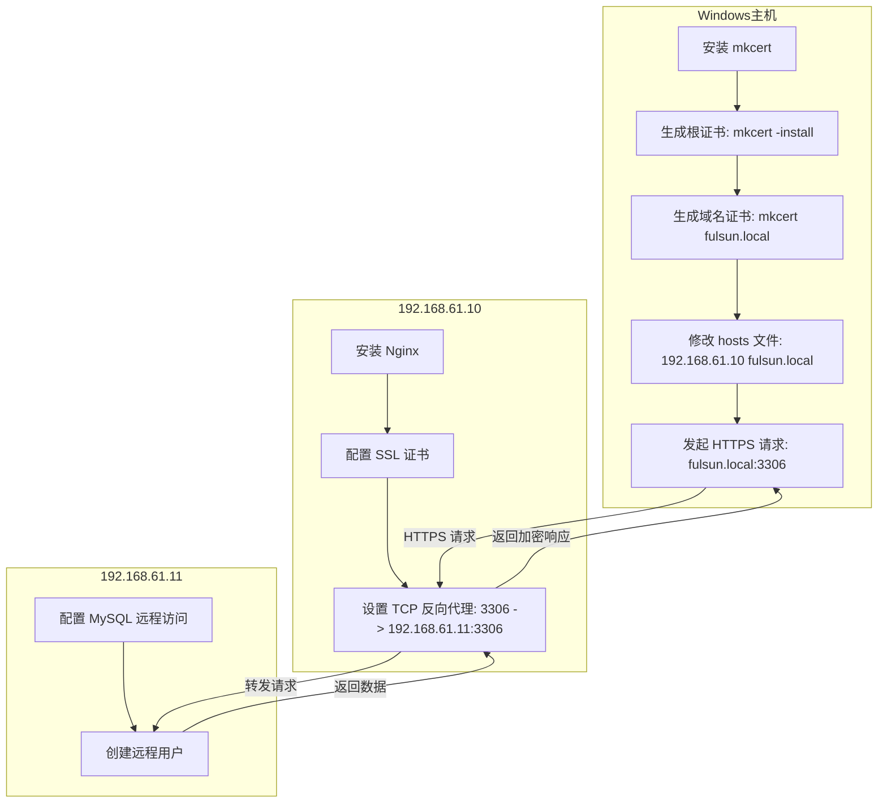

介绍 mkcert 工具一键生成本地可信 HTTPS 证书的完整流程，涵盖安装配置、多域名支持及浏览器信任设置。无需复杂 CA 申请，轻松实现 localhost 开发环境 HTTPS 化，提升前后端联调安全性与效率。

<!-- more -->

***

## 前言

以前本地开发搭建 https 环境时，使用的是自签证书，由于浏览器不信任自签证书，经常需要在警告页面点击继续访问，有些麻烦：


有时甚至没有继续访问的按钮，就需要到 `chrome://net-internals/#hsts` 里删除相关域名，更麻烦了，而且过段时间后还需要重复操作：


为了不这么麻烦，需要我们将自签证书使用的根证书添加到系统的可信 CA 证书中，这样就不会出现警告了。当然了达到这个效果需要执行一堆 `openssl` 命令，确实繁琐，好在已经有了封装了这些的小工具 —— [mkcert](https://github.com/FiloSottile/mkcert) 。

## mkcert

### 介绍

> [mkcert](https://github.com/FiloSottile/mkcert) 是一个使用 go 语言编写的生成本地自签证书的小程序，具有跨平台、使用简单、支持多域名、自动信任 CA 等一系列方便的特性可供本地开发时快速创建 https 环境使用。


### 安装

安装方式也非常简单，由于 go 语言的静态编译和跨平台的特性，官方提供各平台预编译的版本，直接下载到本地，给可执行权限(Linux/Unix 需要)就可以了。下载地址: <https://github.com/FiloSottile/mkcert/releases/latest>

#### Windows

- 使用 [Chocolatey](https://chocolatey.org/) 或 [Scoop](https://github.com/ScoopInstaller/scoop)

  ```sh
  choco install mkcert
  # 或者
  scoop bucket add extras
  scoop install mkcert
  ```

- 或者直接下载编译好的文件

  访问 [GitHub Releases](https://github.com/FiloSottile/mkcert/releases) 下载（[备用链接](https://download.fastgit.org/FiloSottile/mkcert/releases/download/v1.4.4/mkcert-v1.4.4-windows-amd64.exe)）

  然后可以重命名文件为 `mkcert.exe` ，所在路径放到环境变量 Path 里，方便直接以 `mkcert` 命令运行

  如果运行时有问题的话，切换为以管理员运行

  

#### macOS / Linux

使用 [Homebrew](https://brew.sh/) / [Homebrew on Linux](https://docs.brew.sh/Homebrew-on-Linux)

```mipsasm
brew install mkcert
brew install nss # 如果使用 Firefox

yum install mkcert
```

### mkcert 命令

安装成功后，应该可以使用`mkcert`命令了,从上面自带的帮助输出来看，`mkcert`已经给出了一个基本的工作流，规避了繁杂的`openssl`命令，几个简单的参数就可以生成一个本地可信的 https 证书了。更详细的用法直接看[官方文档](https://github.com/FiloSottile/mkcert#mkcert)就好。

```sh
PS C:\Users\abcfy\projects> mkcert
Using the local CA at "C:\Users\abcfy\AppData\Local\mkcert" ✨
Usage of mkcert:

        $ mkcert -install
        Install the local CA in the system trust store.

        $ mkcert example.org
        Generate "example.org.pem" and "example.org-key.pem".

        $ mkcert example.com myapp.dev localhost 127.0.0.1 ::1
        Generate "example.com+4.pem" and "example.com+4-key.pem".

        $ mkcert "*.example.it"
        Generate "_wildcard.example.it.pem" and "_wildcard.example.it-key.pem".

        $ mkcert -uninstall
        Uninstall the local CA (but do not delete it).

For more options, run "mkcert -help".
```

## 安装实例



### 信任 CA 证书

> ⚠ Warning
>
> mkcert 自动生成的 `rootCA-key.pem` 文件提供了拦截来自本机安全请求的完整能力。不要分享这个文件。

将 mkcert 使用的根证书加入本地可信 CA 中，以后由该 CA 签发的证书在**本地**都是可信的

```sh
mkcert.exe --install
The local CA is now installed in the system trust store! ⚡️
The local CA is now installed in Java's trust store! ☕️
```


可能不支持火狐浏览器


然后可以在 Windows 的可信 CA 列表找到该证书：


在 MacOS 的证书列表同样也可以找到:


### 生成自签证书

- 会在当前目录生成证书文件和私钥文件，然后就可以用在 nginx 上了

  ```sh
  # mkcert fulsun.local
  # 生成通配符证书（覆盖 *.fulsun.local 和主域名）
  mkcert "*.fulsun.local" fulsun.local


  Created a new certificate valid for the following names 📜
   - "fulsun.local"

  The certificate is at "./fulsun.local.pem" and the key at "./fulsun.local-key.pem" ✅

  It will expire on 1 August 2027 🗓
  ```

- 配置域名映射

  `C:\Windows\System32\drivers\etc\hosts`（需管理员权限）。

  ```plaintext
  192.168.61.10 fulsun.local
  ```

### 安装 nginx

1. 在 192.168.61.10 虚拟机下安装 Nginx。 官网 [下载 nginx](http://nginx.org/en/download.html) 或使用包管理器安装，具体步骤不再赘述

   ```sh
   dnf install -y nginx
   ```

2. **上传证书到 Nginx 虚拟机**：将 `fulsun.local.pem` 和 `fulsun.local-key.pem` 复制到虚拟机，例如 `/usr/local/nginx/ssl`。

### 配置 Nginx 的 TCP 反向代理

- 修改虚拟机下的 nginx 配置

  ```sh
  # vi /usr/local/nginx/conf/nginx.conf
  # 监听 80 端口，强制跳转到 HTTPS
  server {
      listen 80;
      listen [::]:80;
      server_name fulsun.local;

      # 301 永久重定向到 HTTPS
      return 301 https://$host$request_uri;
  }

  server {
      listen 443 ssl;
      # 修改为所需域名或者 localhost
      server_name fulsun.local;
      index index.html index.htm index.php default.html default.htm default.php;
      root html;

      # 修改为生成文件目录
   	ssl_certificate /usr/local/nginx/ssl/fulsun.local.pem;
      # 修改为生成文件目录
      ssl_certificate_key /usr/local/nginx/ssl/fulsun.local-key.pem;

      ssl_session_cache shared:SSL:1m; ssl_session_timeout 5m;
      ssl_ciphers HIGH:!aNULL:!MD5; ssl_prefer_server_ciphers on;

      # 此处为个人需求，代理请求到 80 端口
      location / {
          proxy_pass http://127.0.0.1;
          proxy_set_header Host $proxy_host;
          proxy_set_header X-Real-IP $remote_addr;
          proxy_set_header X-Forwarded-For $proxy_add_x_forwarded_for;
          proxy_set_header Via "nginx";
      }
  }
  ```

### 检查是否生效

运行 nginx 后访问，没有警告页面


之后如果证书过期的话再重新执行一遍命令即可

## mkcert 其他选项

- 注意：需要将这些选项放在域名之前

  ```sh
  -cert-file FILE, -key-file FILE, -p12-file FILE
    自定义输出路径/文件名。

  -client
    生成用于客户端身份验证的证书。

  -ecdsa
    使用 ECDSA 密钥生成证书。

  -pkcs12
    生成 PKCS12 格式的证书。Java 程序通常不支持 PEM 格式的证书，但是支持 PKCS12 格式的证书。

  -csr CSR
    根据提供的 CSR 生成证书。与除 -install 和 -cert-file 之外的所有其他选项冲突。
  ```

- 例子：

  ```sh
  mkcert -key-file key.pem -cert-file cert.pem example.com *.example.com
  ```

## 局域网内使用

参照 [本地 https 快速解决方案](https://blog.dteam.top/posts/2019-04/%E6%9C%AC%E5%9C%B0https%E5%BF%AB%E9%80%9F%E8%A7%A3%E5%86%B3%E6%96%B9%E6%A1%88mkcert.html)

有时候我们需要在局域网内测试 https 应用，这种环境可能不对外，因此也无法使用像 `Let's encrypt` 这种免费证书的方案给局域网签发一个可信的证书，而且 `Let's encrypt` 本身也不支持认证 ip。

先来回忆一下证书可信的三个要素：

- 由可信的 CA 机构签发
- 访问的地址跟证书认证地址相符
- 证书在有效期内

如果期望我们自签证书在局域网内使用，以上三个条件都需要满足。很明显自签证书一定可以满足证书在有效期内，那么需要保证后两条。我们签发的证书必须匹配浏览器的地址栏，比如局域网的 ip 或者域名，此外还需要信任 CA。

我们先重新签发一下证书，加上本机的局域网 ip 认证：

```sh
PS C:\Users\taobao> mkcert localhost 127.0.0.1 ::1 192.168.61.11

Created a new certificate valid for the following names 📜
 - "localhost"
 - "127.0.0.1"
 - "::1"
 - "192.168.61.11"

The certificate is at "./localhost+3.pem" and the key at "./localhost+3-key.pem" ✅

It will expire on 29 January 2027 🗓
```

再次验证发现使用 `https://192.168.61.11` 本机访问也是可信的。然后我们需要将 CA 证书发放给局域网内其他的用户。

```sh
# 使用 mkcert -CAROOT 令可以列出 CA 证书的存放路径
PS C:\Users\abcfy> mkcert -CAROOT
C:\Users\abcfy\AppData\Local\mkcert

PS C:\Users\abcfy> ls $(mkcert -CAROOT)

    目录：C:\Users\abcfy\AppData\Local\mkcert

Mode                LastWriteTime         Length Name
----                -------------         ------ ----
-a----  2019-04-09-星期二  上午 1           2484 rootCA-key.pem
                             2:16
-a----  2019-04-09-星期二  上午 1           1651 rootCA.pem
                             2:16
```

可以看到 CA 路径下有两个文件 `rootCA-key.pem` 和 `rootCA.pem` 两个文件，用户需要信任 `rootCA.pem` 这个文件。将 `rootCA.pem` 拷贝一个副本，并命名为 `rootCA.crt`（因为 windows 并不识别 `pem` 扩展名，并且 Ubuntu 也不会将 `pem` 扩展名作为 CA 证书文件对待），将 `rootCA.crt` 文件分发给其他用户，手工导入。

- windows 导入证书的方法是双击这个文件，在证书导入向导中将证书导入 `受信任的根证书颁发机构` :


- MacOS 的做法也一样，同样选择将 CA 证书导入到受信任的根证书颁发机构。

- Ubuntu 的做法可以将证书文件（必须是`crt`后缀）放入 `/usr/local/share/ca-certificates/` ，然后执行 `sudo update-ca-certificates`

- Android 和 iOS 信任 CA 证书的做法参考 [官方文档](https://github.com/FiloSottile/mkcert#mobile-devices)。

- 在局域网其他计算机就可以访问 https 而不报警了。我在另一台虚拟机 Ubuntu 上使用 curl 测试结果：

  ```sh
  $ curl -I https://192.168.31.170
  HTTP/1.0 200 OK
  Server: SimpleHTTP/0.6 Python/3.6.8
  Date: Tue, 09 Apr 2019 05:22:12 GMT
  Content-type: text/html; charset=utf-8
  Content-Length: 1794

  # 无警告，加上 `-v` 参数输出还会告诉证书是可信的。
  ```

## Reference

<https://www.nanoka.top/posts/d845bf65/>

<https://github.com/FiloSottile/mkcert>

<https://www.jianshu.com/p/7cb5c2cffaaa>
