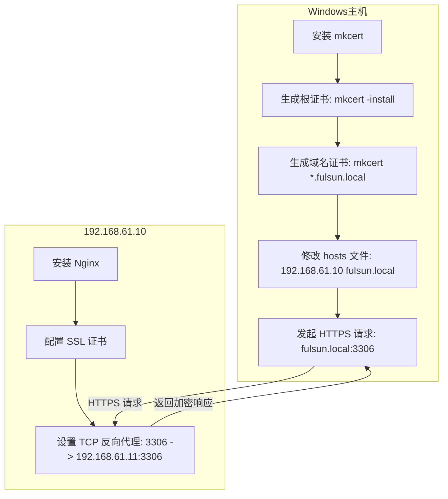

介绍 mkcert 工具一键生成本地可信 HTTPS 证书的完整流程，涵盖安装配置、多域名支持及浏览器信任设置。无需复杂 CA 申请，轻松实现 localhost 开发环境 HTTPS 化，提升前后端联调安全性与效率。

<!-- more -->

***

## 前言

以前本地开发搭建 https 环境时，使用的是自签证书，由于浏览器不信任自签证书，经常需要在警告页面点击继续访问，有些麻烦：


有时甚至没有继续访问的按钮，就需要到 `chrome://net-internals/#hsts` 里删除相关域名，更麻烦了，而且过段时间后还需要重复操作：


为了不这么麻烦，需要我们将自签证书使用的根证书添加到系统的可信 CA 证书中，这样就不会出现警告了。当然了达到这个效果需要执行一堆 `openssl` 命令，确实繁琐，好在已经有了封装了这些的小工具 —— [mkcert](https://github.com/FiloSottile/mkcert) 。

## mkcert介绍

> [mkcert](https://github.com/FiloSottile/mkcert) 是一个使用 go 语言编写的生成本地自签证书的小程序，具有跨平台、使用简单、支持多域名、自动信任 CA 等一系列方便的特性可供本地开发时快速创建 https 环境使用。


### 安装

安装方式也非常简单，由于 go 语言的静态编译和跨平台的特性，官方提供各平台预编译的版本，直接下载到本地，给可执行权限(Linux/Unix 需要)就可以了。下载地址: <https://github.com/FiloSottile/mkcert/releases/latest>

#### Windows

- 使用 [Chocolatey](https://chocolatey.org/) 或 [Scoop](https://github.com/ScoopInstaller/scoop)

  ```sh
  choco install mkcert
  # 或者
  scoop bucket add extras
  scoop install mkcert
  ```

- 或者直接下载编译好的文件

  访问 [GitHub Releases](https://github.com/FiloSottile/mkcert/releases) 下载（[备用链接](https://download.fastgit.org/FiloSottile/mkcert/releases/download/v1.4.4/mkcert-v1.4.4-windows-amd64.exe)）

  然后可以重命名文件为 `mkcert.exe` ，所在路径放到环境变量 Path 里，方便直接以 `mkcert` 命令运行

  如果运行时有问题的话，切换为以管理员运行

  

#### macOS / Linux

使用 [Homebrew](https://brew.sh/) / [Homebrew on Linux](https://docs.brew.sh/Homebrew-on-Linux)

```mipsasm
brew install mkcert
brew install nss # 如果使用 Firefox

yum install mkcert
```

## mkcert 命令

安装成功后，应该可以使用`mkcert`命令了,从上面自带的帮助输出来看，`mkcert`已经给出了一个基本的工作流，规避了繁杂的`openssl`命令，几个简单的参数就可以生成一个本地可信的 https 证书了。更详细的用法直接看[官方文档](https://github.com/FiloSottile/mkcert#mkcert)就好。

```sh
PS C:\Users\abcfy\projects> mkcert
Using the local CA at "C:\Users\abcfy\AppData\Local\mkcert" ✨
Usage of mkcert:

        $ mkcert -install
        Install the local CA in the system trust store.

        $ mkcert example.org
        Generate "example.org.pem" and "example.org-key.pem".

        $ mkcert example.com myapp.dev localhost 127.0.0.1 ::1
        Generate "example.com+4.pem" and "example.com+4-key.pem".

        $ mkcert "*.example.it"
        Generate "_wildcard.example.it.pem" and "_wildcard.example.it-key.pem".

        $ mkcert -uninstall
        Uninstall the local CA (but do not delete it).

For more options, run "mkcert -help".
```

## mkcert 其他选项

- 注意：需要将这些选项放在域名之前

  ```sh
  -cert-file FILE, -key-file FILE, -p12-file FILE
    自定义输出路径/文件名。

  -client
    生成用于客户端身份验证的证书。

  -ecdsa
    使用 ECDSA 密钥生成证书。

  -pkcs12
    生成 PKCS12 格式的证书。Java 程序通常不支持 PEM 格式的证书，但是支持 PKCS12 格式的证书。

  -csr CSR
    根据提供的 CSR 生成证书。与除 -install 和 -cert-file 之外的所有其他选项冲突。
  ```

- 例子：

  ```sh
  mkcert -key-file key.pem -cert-file cert.pem example.com *.example.com
  ```

## 配置示例



### 信任 CA 根证书

> ⚠ Warning
>
> mkcert 自动生成的 `rootCA-key.pem` 文件提供了拦截来自本机安全请求的完整能力。不要分享这个文件。

- 将 mkcert 使用的根证书加入本地可信 CA 中，以后由该 CA 签发的证书在**本地**都是可信的

  ```sh
  mkcert.exe --install
  The local CA is now installed in the system trust store! ⚡️
  The local CA is now installed in Java's trust store! ☕️
  ```

  

- 然后可以在 Windows 的可信 CA 列表找到该证书

### 生成自签证书

- 会在当前目录生成证书文件和私钥文件，然后就可以用在 nginx 上了

  ```sh
  $ mkcert "*.fulsun.local" fulsun.local

  Created a new certificate valid for the following names 📜
   - "*.fulsun.local"
   - "fulsun.local"

  Reminder: X.509 wildcards only go one level deep, so this won't match a.b.fulsun.local ℹ️

  The certificate is at "./_wildcard.fulsun.local+1.pem" and the key at "./_wildcard.fulsun.local+1-key.pem" ✅

  It will expire on 5 August 2027 🗓
  ```

- 配置域名映射`C:\Windows\System32\drivers\etc\hosts`（需管理员权限）。

  ```plaintext
  192.168.61.10 fulsun.local
  ```

### 配置 Nginx 的 TCP 反向代理

1. 在 192.168.61.10 虚拟机下安装 Nginx。 官网 [下载 nginx](http://nginx.org/en/download.html) 或使用包管理器安装，具体步骤不再赘述

   ```sh
   # dnf install -y nginx
   sudo dnf install nginx-mod-stream
   ```

2. **上传证书到 Nginx 虚拟机**：将 `./_wildcard.fulsun.local+1.pem` 和 `./_wildcard.fulsun.local+1-key.pem` 复制到虚拟机，例如 `/etc/nginx/ssl`。

3. 修改虚拟机下的 nginx 配置

   ```sh
   # vi /usr/local/nginx/conf/nginx.conf
   # 监听 80 端口，强制跳转到 HTTPS
   server {
       listen 80;
       listen [::]:80;
       server_name fulsun.local;

       # 301 永久重定向到 HTTPS
       return 301 https://$host$request_uri;
   }

   server {
       listen 443 ssl;
       # 修改为所需域名或者 localhost
       server_name fulsun.local;
       index index.html index.htm index.php default.html default.htm default.php;
       root html;

       # mkcert 生成的证书路径（需放在 Nginx 可访问的位置）
       ssl_certificate /etc/nginx/ssl/_wildcard.fulsun.local+1.pem;
       ssl_certificate_key /etc/nginx/ssl/_wildcard.fulsun.local+1-key.pem;

       ssl_session_cache shared:SSL:1m; ssl_session_timeout 5m;
       ssl_ciphers HIGH:!aNULL:!MD5; ssl_prefer_server_ciphers on;

       # 此处为个人需求，代理请求到 80 端口
       location / {
           proxy_pass http://127.0.0.1;
           proxy_set_header Host $proxy_host;
           proxy_set_header X-Real-IP $remote_addr;
           proxy_set_header X-Forwarded-For $proxy_add_x_forwarded_for;
           proxy_set_header Via "nginx";
       }
   }
   ```

### 检查是否生效

运行 nginx 后访问，没有警告页面,证书也是有效状态，之后如果证书过期的话再重新执行一遍命令即可


### 访问Mysql服务

- Nginx 需要启用 `ngx_stream_core_module` 模块来代理 TCP 流量（如 MySQL 的 3306 端口）。

- 在虚拟机192.168.61.11中启动一个mysql服务

  ```sh
  docker pull swr.cn-north-4.myhuaweicloud.com/ddn-k8s/gcr.io/ml-pipeline/mysql:8.0.26
  docker rm -f mysql
  # 启动容器
  docker run \
  -p 3306:3306 \
  --restart=always \
  --name mysql \
  --privileged=true \
  -e MYSQL_ROOT_PASSWORD=123456 \
  -d swr.cn-north-4.myhuaweicloud.com/ddn-k8s/gcr.io/ml-pipeline/mysql:8.0.26
  ```

- Nginx代理服务

  ```sh
  # 在Nginx主配置文件（通常为/etc/nginx/nginx.conf）的​​顶层​​（不在http{}块内）添加如下配置：
  stream {
      server {
          listen     3306;  # 纯 TCP 监听，无 SSL
          proxy_pass 192.168.61.11:3306;

          # 增加 TCP 代理优化参数
          proxy_connect_timeout 60s;
          proxy_timeout       24h;  # 避免长连接超时
          proxy_buffer_size   16k;  # 调大缓冲区防止分包
      }
  }
  ```

- 访问mysql服务成功
  

## Reference

<https://www.nanoka.top/posts/d845bf65/>

<https://github.com/FiloSottile/mkcert>

<https://www.jianshu.com/p/7cb5c2cffaaa>
